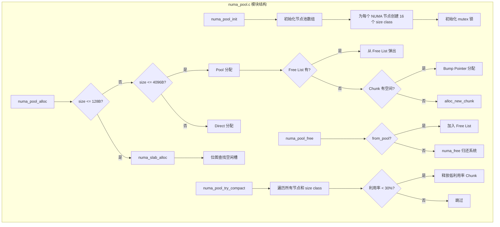
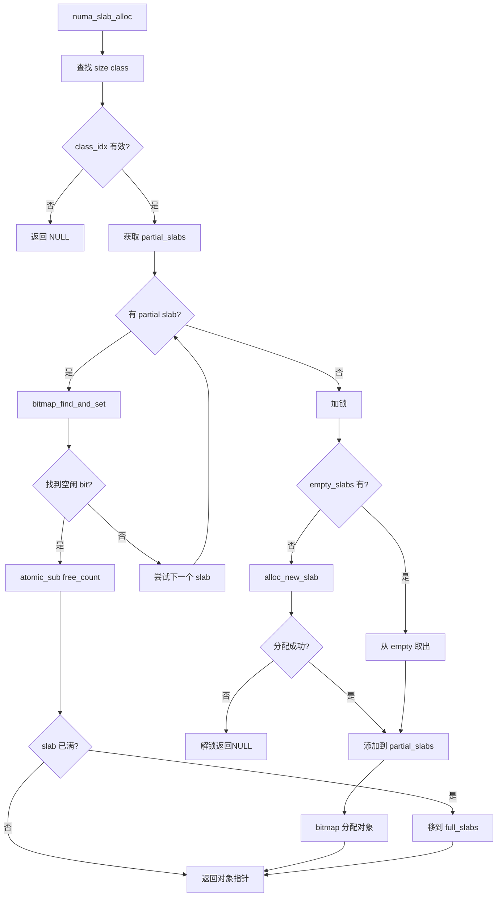
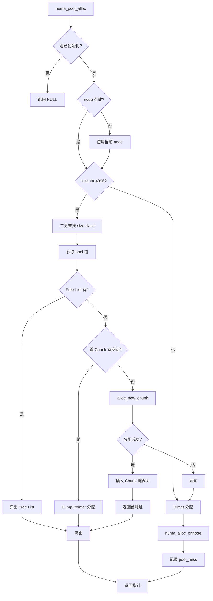
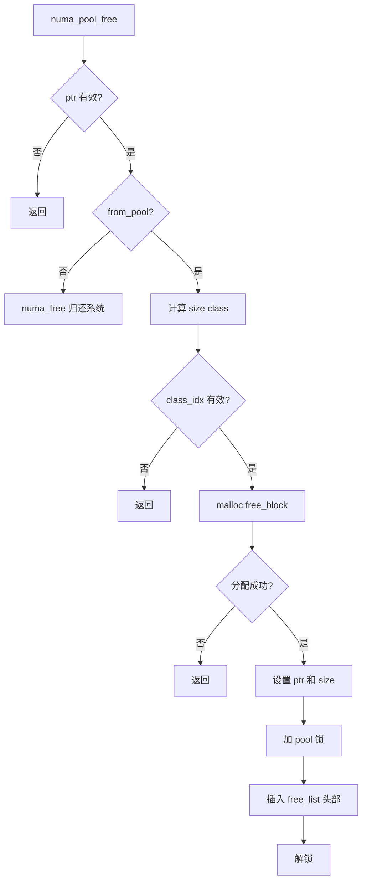
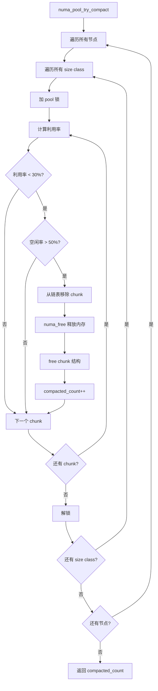

# NUMA 内存池模块

## 模块概述

`numa_pool.c/h` 是本项目的核心内存管理模块，为 NUMA 系统提供节点粒度的内存池分配器。通过预分配大块内存（Chunks）并按需分配小对象，显著减少 `numa_alloc_onnode` 系统调用次数，同时降低内存碎片率。

**版本**：v3.2-P2

## 解决的核心问题

1. **系统调用开销**：每次 `numa_alloc_onnode` 都是昂贵系统调用，高频分配场景性能差
2. **内存碎片**：小对象频繁分配释放导致碎片率高达 27%
3. **大小对象统一处理**：不同大小的对象需要不同的分配策略以优化空间利用率

## 核心数据结构

### 内存块（Chunk）

```c
typedef struct numa_pool_chunk {
    void *memory;                    // NUMA 分配的内存块基址
    size_t size;                     // Chunk 总大小（256KB/512KB/1MB）
    size_t offset;                   // Bump Pointer 当前偏移
    size_t used_bytes;               // 已使用字节数（用于利用率追踪）
    struct numa_pool_chunk *next;    // 同级别 Chunk 链表
} numa_pool_chunk_t;
```

### 空闲块（Free Block）

```c
typedef struct free_block {
    void *ptr;                       // 空闲块地址
    size_t size;                     // 空闲块大小
    struct free_block *next;         // 空闲链表
} free_block_t;
```

### 大小级别池

```c
typedef struct {
    size_t obj_size;                         // 该级别的对象大小
    numa_pool_chunk_t *chunks;               // Chunk 链表
    free_block_t *free_list;                 // P1 优化：空闲块链表
    pthread_mutex_t lock;                    // 线程安全锁
} numa_size_class_pool_t;
```

### 内存池句柄（每节点一个）

```c
struct numa_pool {
    int node_id;                             // NUMA 节点 ID
    int available;                           // 是否可用
    numa_size_class_pool_t size_classes[NUMA_POOL_SIZE_CLASSES];  // 16 个级别
    // Slab 分配器（≤128B 小对象快速路径）
    numa_slab_cache_t slab_cache[SLAB_SIZE_CLASSES];
};
```

## 模块架构图



## 三层分配架构

```mermaid
graph LR
    A[分配请求 size] --> B{size <= 128B?}
    B -->|是| C[Slab 分配器]
    B -->|否| D{size <= 4096B?}
    D -->|是| E[Pool 分配器]
    D -->|否| F[Direct 分配]
    
    C --> C1[16KB slab]
    C --> C2[512bit 位图]
    C --> C3[原子操作 O(1)]
    C --> C4[碎片率 ~1%]
    
    E --> E1[16 级 size 分类]
    E --> E2[Bump Pointer]
    E --> E3[Free List 复用]
    E --> E4[碎片率 ~2.4%]
    
    F --> F1[numa_alloc_onnode]
    F --> F2[系统调用]
```

### 16 级 Size 分类

| 级别 | 对象大小 | Chunk 大小 | 适用场景 |
|------|---------|-----------|---------|
| 0-2 | 16/32/48B | 256KB | 极小对象（字符串指针、整数） |
| 3-5 | 64/96/128B | 256KB | 小对象（短字符串、小结构体） |
| 6-9 | 192-512B | 512KB | 中等对象（中等字符串） |
| 10-13 | 768B-2KB | 1MB | 较大对象（长字符串） |
| 14-15 | 3-4KB | 1MB | 大对象（接近阈值） |

完整数组定义：
```c
const size_t numa_pool_size_classes[NUMA_POOL_SIZE_CLASSES] = {
    16, 32, 48, 64, 96, 128, 192, 256, 384, 512,
    768, 1024, 1536, 2048, 3072, 4096
};
```

### 动态 Chunk 大小

根据对象大小自动选择最优 Chunk 大小：

```c
size_t get_chunk_size_for_object(size_t obj_size) {
    if (obj_size <= 256)  return CHUNK_SIZE_SMALL;   // 256KB
    if (obj_size <= 1024) return CHUNK_SIZE_MEDIUM;  // 512KB
    return CHUNK_SIZE_LARGE;                         // 1MB
}
```

## 关键实现

### Slab 分配器（≤128B）

**设计**：
- 每个 slab 为 16KB 固定大小
- 使用 512bit 位图管理槽位（16KB / 128B = 128 个槽位，实际 512bit 支持更细粒度）
- 原子位图操作实现无锁分配

**分配流程图**：



**空闲缓存**：
每个大小级别保留最多 `SLAB_EMPTY_CACHE_MAX`（2个）空闲 slab，加速后续分配。

### Pool 分配器（≤4KB）

**分配流程图**：



**Free List 复用**：
当对象释放时，不立即归还系统，而是加入 Free List 供后续分配复用：



### Compact 压缩机制

定期检查低利用率 Chunk 并回收：



触发条件：
- 利用率 < 30%（`COMPACT_THRESHOLD`）
- 空闲率 > 50%（`COMPACT_MIN_FREE_RATIO`）
- 每 N 次 serverCron 检查一次（`COMPACT_CHECK_INTERVAL = 10`）

## 关键函数

| 函数 | 功能 | 返回值 |
|------|------|--------|
| `numa_pool_init()` | 初始化所有 NUMA 节点的内存池 | 0=成功, -1=失败 |
| `numa_pool_cleanup()` | 清理所有内存池，释放 NUMA 内存 | - |
| `numa_pool_alloc(size, node)` | 从指定节点池分配内存 | 含 PREFIX 的指针 / NULL |
| `numa_pool_free(ptr, size, from_pool)` | 释放池内存（加入 Free List 或归还系统） | - |
| `numa_pool_get_stats(node, stats)` | 获取指定节点统计信息 | - |
| `numa_pool_try_compact()` | 压缩低利用率 Chunk | 被压缩的 Chunk 数 |
| `numa_pool_get_utilization(node, class)` | 获取 Chunk 利用率（0.0~1.0） | float |

## Slab 分配器函数

| 函数 | 功能 |
|------|------|
| `numa_slab_init()` | 初始化所有节点的 Slab 分配器 |
| `numa_slab_cleanup()` | 清理所有 Slab |
| `numa_slab_alloc(size, node)` | 从 Slab 分配小对象（≤128B） |
| `numa_slab_free(ptr, size, node)` | 释放 Slab 对象（原子位图标记空闲） |
| `should_use_slab(size)` | 判断是否应走 Slab 路径 |

## 配置参数

```c
// numa_pool.h 中的编译时常量
#define NUMA_POOL_SIZE_CLASSES      16       // 大小级别数量
#define NUMA_POOL_MAX_ALLOC         4096     // 池分配的最大对象大小
#define SLAB_SIZE                   16384    // 16KB slab 大小
#define SLAB_MAX_OBJECT_SIZE        128      // Slab 最大对象大小
#define SLAB_BITMAP_SIZE            16       // 512bit 位图
#define SLAB_EMPTY_CACHE_MAX        2        // 每级别空闲 slab 缓存
#define COMPACT_THRESHOLD           0.3      // 压缩阈值（30%）
#define COMPACT_MIN_FREE_RATIO      0.5      // 最小空闲率（50%）
#define COMPACT_CHECK_INTERVAL      10       // 压缩检查间隔
#define CHUNK_SIZE_SMALL            262144   // 256KB
#define CHUNK_SIZE_MEDIUM           524288   // 512KB
#define CHUNK_SIZE_LARGE            1048576  // 1MB
```

## PREFIX 元数据

所有通过 Pool/Slab 分配的内存都包含 16 字节前缀：

```c
typedef struct {
    size_t size;           // 8B - 实际对象大小
    char from_pool;        // 1B - 来源标记（0=Direct, 1=Pool, 2=Slab）
    char node_id;          // 1B - NUMA 节点 ID
    uint8_t hotness;       // 1B - 热度级别（0-7）
    uint8_t access_count;  // 1B - 访问计数
    uint16_t last_access;  // 2B - LRU 时钟低 16 位
    char reserved[2];      // 2B - 保留
} numa_alloc_prefix_t;     // 总计 16 字节
```

用户实际获得的是 `prefix + 1` 位置的指针，释放时通过指针偏移找回 PREFIX。

## 统计信息

```c
typedef struct {
    size_t total_allocated;     // 已分配总字节数
    size_t total_from_pool;     // 从池分配的字节数
    size_t total_direct;        // 直接分配的字节数
    size_t chunks_allocated;    // 已分配 Chunk 数量
    size_t pool_hits;           // 池命中次数（复用 Free List）
    size_t pool_misses;         // 池未命中次数（新分配 Chunk）
} numa_pool_stats_t;
```

## 性能优化历程

| 版本 | 优化内容 | 碎片率 | 内存效率 | 吞吐 |
|------|---------|-------|---------|------|
| P0 | 基础 Pool，8 级分类 | 27% | 27% | 96K req/s |
| P1 | Free List 复用 + Compact 机制，16 级分类 | 2.36% | 43% | 改善 |
| P2 | Slab 分配器（≤128B），chunk 增大 | 1.02% | 98% | 169-188K req/s |

## 与其他模块的交互

### 与 zmalloc 的关系

`zmalloc.c` 是分配入口，根据对象大小选择路径：

```c
void *zmalloc(size_t size) {
    int node = get_current_numa_node();

    if (should_use_slab(size)) {
        return numa_slab_alloc(size, node, &total_size);
    } else if (size <= NUMA_POOL_MAX_ALLOC) {
        return numa_pool_alloc(size, node, &total_size);
    } else {
        // Direct 分配
        void *ptr = numa_alloc_onnode(size + PREFIX_SIZE, node);
        // 写入 PREFIX
        return ptr + PREFIX_SIZE;
    }
}
```

### 与 Key 迁移的关系

迁移时需要读取 PREFIX 中的 `node_id` 判断 Key 当前所在节点：

```c
int numa_get_key_current_node(robj *val) {
    numa_alloc_prefix_t *prefix = (numa_alloc_prefix_t *)val - 1;
    return prefix->node_id;
}
```

### 与策略框架的关系

serverCron 定期调用 `numa_pool_try_compact()` 回收低利用率 Chunk：

```c
// server.c 中
run_with_period(1000 * COMPACT_CHECK_INTERVAL) {
    numa_pool_try_compact();
}
```

## 线程安全

每个大小级别有独立的 `pthread_mutex_t lock`，不同级别的分配可并行执行：

```
线程 A 分配 64B 对象 ──► 锁定 level 3 ──► 分配
线程 B 分配 1KB 对象 ──► 锁定 level 11 ──► 分配（并行）
```

## 降级策略

当 NUMA 不可用时（单节点系统或未安装 libnuma）：
- `numa_pool_available()` 返回 0
- 分配回退到标准 `malloc`
- 所有 NUMA 命令返回友好错误信息
