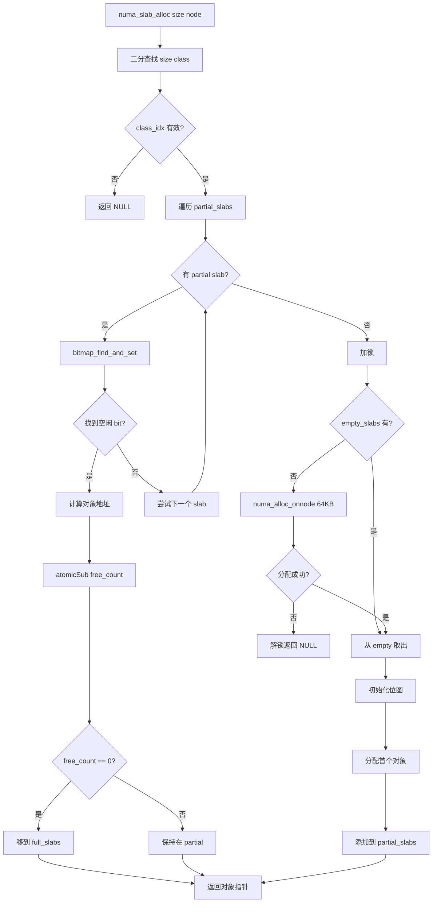
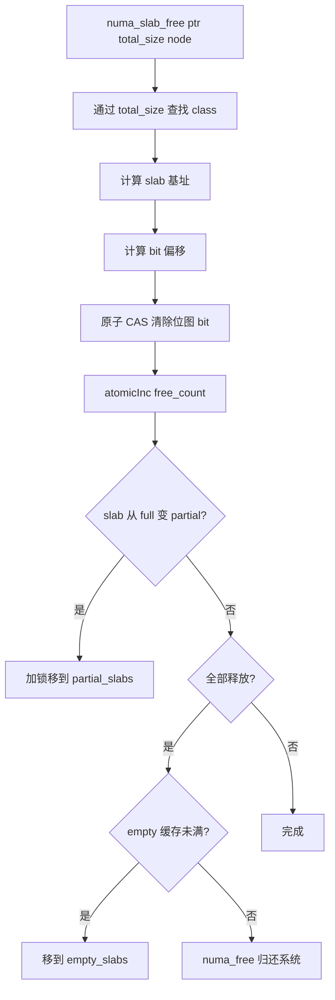

# NUMA Slab 分配器模块

## 模块概述

`numa_pool.c/h` 是本项目的内存管理模块，采用 **jemalloc 风格的纯 Slab 分配器**，为 8B-4KB 对象提供 O(1) 无锁分配。大于 4KB 的对象走 `numa_alloc_onnode` 直接分配。

**版本**：v4.0（纯 Slab 重构）

## 架构设计

当前采用两层分配架构，旧版的 Chunk/Pool/Free List 三层架构已移除：

```
分配请求 (size)
    │
    ▼
should_use_slab(size)?
    │
    ├── size ≤ 4KB ──► numa_slab_alloc()    [Slab 路径]
    │       │
    │       ├── 24 级 jemalloc 风格大小 class
    │       ├── 64KB Slab + 3072bit 位图
    │       └── 原子 CAS 无锁分配
    │
    └── size > 4KB ──► numa_alloc_onnode()   [Direct 路径]
            └── 系统调用，分配 size + PREFIX
```

## 核心数据结构

### Slab 配置常量

```c
#define NUMA_POOL_SIZE_CLASSES  24          // jemalloc 风格 24 级大小 class
#define SLAB_SIZE               (64 * 1024) // 64KB slab
#define SLAB_MAX_OBJECT_SIZE    4096        // Slab 处理 8B-4KB 的对象
#define SLAB_BITMAP_SIZE        96          // 3072bit 位图（96 × 32bit）
#define SLAB_EMPTY_CACHE_MAX    8           // 每级别保留的空闲 slab 缓存
```

### 24 级大小分类

采用 jemalloc 风格的大小 class，覆盖 8B 到 4KB：

```c
const size_t numa_pool_size_classes[NUMA_POOL_SIZE_CLASSES] = {
    8, 16, 32, 48, 64, 96, 128, 160, 192, 256,
    320, 384, 512, 640, 768, 1024, 1280, 1536, 2048, 2560,
    3072, 3584, 4096
};
```

| 级别 | 大小范围 | 典型用途 |
|------|---------|---------|
| 0-6 | 8B-128B | SDS 短字符串、Redis 对象头、dictEntry |
| 7-11 | 160B-384B | SDS 中等字符串、小 hash/zset 元素 |
| 12-15 | 512B-1024B | SDS 长字符串、robj 包装 |
| 16-19 | 1280B-2048B | 大 SDS、多字段元素 |
| 20-22 | 2560B-3584B | 较大对象 |
| 23 | 4096B | Slab 上限 |

### Slab 结构

```c
typedef struct numa_slab {
    void *memory;                           // Slab 内存基址 (64KB aligned)
    uint32_t bitmap[SLAB_BITMAP_SIZE / 32]; // 3072bit 位图 (96 bytes)
    uint16_t free_count;                    // 剩余空闲槽位数
    struct numa_slab *next;                 // 同状态链表指针
} numa_slab_t;
```

### 每节点每级别状态

```c
typedef struct {
    size_t obj_size;                        // 该级别的对象大小
    numa_slab_t *partial_slabs;             // 部分使用的 slab 链表
    numa_slab_t *full_slabs;               // 已满的 slab 链表
    numa_slab_t *empty_slabs;              // 空闲 slab 缓存
    uint32_t slab_count;                   // 当前 slab 总数
    pthread_mutex_t lock;                  // Slab 切换锁（仅切换链表时持锁）
} numa_slab_class_t;
```

## 分配流程


```mermaid
graph TB
    A[numa_slab_alloc size node] --> B[二分查找 size class]
    B --> C{class_idx 有效?}
    C -->|否| D[返回 NULL]
    C -->|是| E[遍历 partial_slabs]
    E --> F{有 partial slab?}
    F -->|是| G[bitmap_find_and_set]
    G --> H{找到空闲 bit?}
    H -->|是| I[计算对象地址]
    I --> J[atomicSub free_count]
    J --> K{free_count == 0?}
    K -->|是| L[移到 full_slabs]
    K -->|否| M[保持在 partial]
    L --> N[返回对象指针]
    M --> N
    H -->|否| O[尝试下一个 slab]
    O --> F
    F -->|否| P[加锁]
    P --> Q{empty_slabs 有?}
    Q -->|是| R[从 empty 取出]
    Q -->|否| S[numa_alloc_onnode 64KB]
    S --> T{分配成功?}
    T -->|否| U[解锁返回 NULL]
    T -->|是| R
    R --> V[初始化位图]
    V --> W[分配首个对象]
    W --> X[添加到 partial_slabs]
    X --> N
```

## 释放流程


```mermaid
graph TB
    A[numa_slab_free ptr total_size node] --> B[通过 total_size 查找 class]
    B --> C[计算 slab 基址]
    C --> D[计算 bit 偏移]
    D --> E[原子 CAS 清除位图 bit]
    E --> F[atomicInc free_count]
    F --> G{slab 从 full 变 partial?}
    G -->|是| H[加锁移到 partial_slabs]
    G -->|否| I{全部释放?}
    I -->|是| J{empty 缓存未满?}
    J -->|是| K[移到 empty_slabs]
    J -->|否| L[numa_free 归还系统]
    I -->|否| M[完成]
```

## 关键函数

| 函数 | 功能 | 返回值 |
|------|------|--------|
| `numa_slab_init()` | 初始化所有 NUMA 节点的 Slab 分配器 | 0=成功, -1=失败 |
| `numa_slab_cleanup()` | 清理所有 Slab，释放内存 | - |
| `numa_slab_alloc(size, node, &total_size)` | 从 Slab 分配对象（8B-4KB） | 含 PREFIX 的指针 / NULL |
| `numa_slab_free(ptr, total_size, node)` | 释放 Slab 对象（原子位图操作） | - |
| `should_use_slab(size)` | `size <= 4096` 返回 1 | int |
| `numa_pool_num_nodes()` | 获取 NUMA 节点数量 | int |
| `numa_pool_get_node()` | 获取当前 CPU 所在 NUMA 节点 | int |
| `numa_pool_available()` | NUMA 是否可用 | int |

## PREFIX 元数据

所有分配都包含 16 字节前缀：

```c
typedef struct {
    size_t size;           // 8B - 实际对象大小
    char from_slab;        // 1B - 来源标记（0=Direct, 1=Slab）
    char node_id;          // 1B - NUMA 节点 ID
    uint8_t hotness;       // 1B - 热度级别（0-7）
    uint8_t access_count;  // 1B - 访问计数
    uint16_t last_access;  // 2B - LRU 时钟低 16 位
    char reserved[2];      // 2B - 保留
} numa_alloc_prefix_t;     // 总计 16 字节
```

释放时通过指针偏移找回 PREFIX：`(numa_alloc_prefix_t *)ptr - 1`

## 线程安全

- **分配/释放**：原子位图操作（CAS），无需持锁
- **Slab 链表切换**：仅在 partial↔full、partial↔empty 切换时持 per-class 锁
- **不同级别完全并行**：24 个级别各有独立锁

```
线程 A 分配 64B ──► class 4 ──► 原子 CAS（无锁）
线程 B 分配 1KB ──► class 15 ──► 原子 CAS（无锁，完全并行）
```

## 降级策略

当 NUMA 不可用时（单节点系统或未安装 libnuma）：
- `numa_pool_available()` 返回 0
- 分配回退到标准 `malloc`
- 所有 NUMA 命令返回友好错误信息
