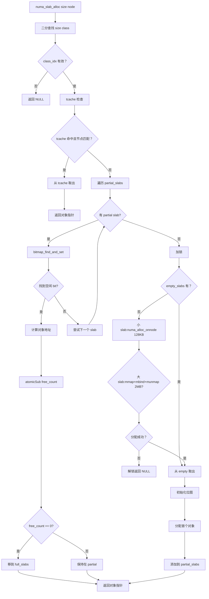

# NUMA Slab 分配器模块

## 模块概述

`numa_pool.c/h` 是本项目的内存管理模块，采用 **jemalloc 风格的纯 Slab 分配器**，为 8B-64KB 对象提供 O(1) 无锁分配。分配器扩展至 33 级大小 class，覆盖 8B 到 64KB 的完整范围。

**版本**：v5.0（大 slab 扩展 + tcache 计数修复）

## 架构设计

当前采用两层 Slab 分配架构，统一覆盖 8B-64KB 对象：

```
分配请求 (size)
    │
    ▼
should_use_slab(size)?
    │
    ├── size ≤ 64KB ──► numa_slab_alloc()    [Slab 路径]
    │       │
    │       ├── 33 级 jemalloc 风格大小 class
    │       ├── 小 slab 64KB（≤4KB 对象）+ 大 slab 2MB（>4KB 对象）
    │       └── 原子 CAS 无锁分配 + tcache 线程缓存
    │
    └── size > 64KB ──► numa_alloc_onnode()   [Direct 路径]
            └── 系统调用，分配 size + PREFIX
```

## 核心数据结构

### Slab 配置常量

```c
#define NUMA_POOL_SIZE_CLASSES  33          // jemalloc 风格 33 级大小 class（8B-64KB）
#define SLAB_SIZE               (64 * 1024) // 64KB 小 slab（≤4KB 对象）
#define LARGE_SLAB_SIZE         (2UL * 1024 * 1024) // 2MB 大 slab（>4KB 对象）
#define SLAB_MAX_OBJECT_SIZE    65536       // Slab 处理 8B-64KB 的对象
#define SLAB_BITMAP_SIZE        96          // 3072bit 位图（96 × 32bit）
#define SLAB_EMPTY_CACHE_MAX    8           // 每级别保留的空闲 slab 缓存
```

### 33 级大小分类

采用 jemalloc 风格的大小 class，覆盖 8B 到 64KB：

```c
const size_t numa_pool_size_classes[NUMA_POOL_SIZE_CLASSES] = {
    8, 16, 24, 32, 48, 64, 80, 96, 128,              /* 小对象（8/16 字节粒度） */
    160, 192, 256, 320, 384, 512, 640, 768,            /* 中对象（32-64 字节粒度） */
    1024, 1280, 1536, 2048, 2560, 3072, 4096,          /* 大对象（128-256 字节粒度） */
    5120, 6144, 7168, 8192, 10240, 12288, 16384, 32768, 65536 /* 超大对象（>4KB，走大 slab） */
};
```

| 级别 | 大小范围 | 典型用途 |
|------|---------|---------|
| 0-6 | 8B-128B | SDS 短字符串、Redis 对象头、dictEntry |
| 7-11 | 160B-384B | SDS 中等字符串、小 hash/zset 元素 |
| 12-15 | 512B-1024B | SDS 长字符串、robj 包装 |
| 16-23 | 1280B-4096B | 大 SDS、多字段元素、8KB value（YCSB 典型负载） |
| 24-32 | 5120B-65536B | 超大对象，走大 slab 路径（2MB mmap+mbind） |

### 两级 Slab 设计

为消除 >4KB 对象的 per-object page 对齐浪费，分配器引入两级 slab 大小：

- **小 slab**（class 0-23，≤4KB 对象）：`SLAB_SIZE = 64KB`，沿用原有 64KB slab + 位图管理
- **大 slab**（class 24-32，>4KB 对象）：`LARGE_SLAB_SIZE = 2MB`，采用 mmap+mbind+munmap 的 memkind 风格分配

**大 slab 分配流程**（消除 page 对齐浪费）：
1. `mmap(NULL, 4MB)` 分配 4MB 虚拟地址空间
2. 找到 2MB 对齐的偏移量
3. `munmap` 释放头部和尾部未对齐区域，仅保留 2MB 对齐部分
4. `mbind(node)` 将 2MB 区域绑定到目标 NUMA 节点
5. 在 2MB slab 内按 size class 细分对象，bitmap 管理

**关键优势**：8KB 对象原本走 direct 路径会触发 `mmap(12288B)` 占用 3 个 page（12KB），浪费 4KB（50%）。现在走大 slab 路径，2MB slab 可容纳 256 个 8KB 对象，RSS 仅为 2MB，消除 per-object page 对齐浪费。

### Slab 结构

```c
typedef struct numa_slab {
    void *memory;                           // Slab 内存基址（64KB/2MB aligned）
    uint32_t bitmap[SLAB_BITMAP_SIZE / 32]; // 3072bit 位图（96 bytes）
    uint16_t free_count;                    // 剩余空闲槽位数
    struct numa_slab *next;                 // 同状态链表指针
    uint16_t class_idx;                     // 大小分类索引
} numa_slab_t;
```

### 每节点每级别状态

```c
typedef struct {
    size_t obj_size;                        // 该级别的对象大小
    numa_slab_t *partial_slabs;             // 部分使用的 slab 链表
    numa_slab_t *full_slabs;                // 已满的 slab 链表
    numa_slab_t *empty_slabs;               // 空闲 slab 缓存
    uint32_t slab_count;                    // 当前 slab 总数
    pthread_mutex_t lock;                   // Slab 切换锁（仅切换链表时持锁）
} numa_slab_class_t;
```

## Thread-Local Cache (tcache)

为消除 tcache free 路径的 CAS 位图竞争，实现无锁化快速路径：

```c
#define TCACHE_BIN_MAX     64   // 每个 size class 的 tcache 容量
#define TCACHE_DRAIN_COUNT 32   // 每次 drain 释放的对象数

typedef struct {
    void *ptrs[TCACHE_BIN_MAX]; // 对象指针数组
    uint16_t count;             // 当前缓存数量
} tcache_bin_t;

typedef struct {
    tcache_bin_t bins[NUMA_POOL_SIZE_CLASSES]; // 33 个 size class 的 bin
} numa_tcache_t;
```

**tcache 计数一致性修复**（v5.0 关键改进）：
- **tcache put 时**：仅缓存对象，**不递减** `used_memory`/`used_memory_node` 统计
- **tcache hit 时**：仅返回对象，**不递增** `used_memory`/`used_memory_node` 统计
- **tcache drain/flush 时**：真正释放到 slab，**此时递减** `used_memory`/`used_memory_node` 统计

此修复消除了之前版本中 `used_memory_node` 出现负值的问题（旧版 put 时递减但 hit 时不递增，导致统计不一致）。

## 分配流程


```mermaid
graph TB
    A[numa_slab_alloc size node] --> B[二分查找 size class]
    B --> C{class_idx 有效？}
    C -->|否 | D[返回 NULL]
    C -->|是 | E[tcache 检查]
    E --> F{tcache 命中且节点匹配？}
    F -->|是 | G[从 tcache 取出]
    G --> H[返回对象指针]
    F -->|否 | I[遍历 partial_slabs]
    I --> J{有 partial slab?}
    J -->|是 | K[bitmap_find_and_set]
    K --> L{找到空闲 bit?}
    L -->|是 | M[计算对象地址]
    M --> N[atomicSub free_count]
    N --> O{free_count == 0?}
    O -->|是 | P[移到 full_slabs]
    O -->|否 | Q[保持在 partial]
    P --> R[返回对象指针]
    Q --> R
    L -->|否 | S[尝试下一个 slab]
    S --> J
    J -->|否 | T[加锁]
    T --> U{empty_slabs 有？}
    U -->|是 | V[从 empty 取出]
    U -->|否 | W[小 slab:numa_alloc_onnode 128KB]
    W --> X{大 slab:mmap+mbind+munmap 2MB?}
    X --> Y{分配成功？}
    Y -->|否 | Z[解锁返回 NULL]
    Y -->|是 | V
    V --> AA[初始化位图]
    AA --> AB[分配首个对象]
    AB --> AC[添加到 partial_slabs]
    AC --> R
```

**大 slab 分配路径**（class 24-32）：
1. `mmap(NULL, 4MB)` 分配 4MB 虚拟地址
2. 计算 2MB 对齐偏移：`offset = (addr + 2MB - 1) & ~(2MB - 1)`
3. `munmap(addr, offset - addr)` 释放头部
4. `munmap(offset + 2MB, 4MB - (offset + 2MB))` 释放尾部
5. `mbind(slab_base, 2MB, MPOL_BIND, node)` 绑定到目标节点
6. 设置 `LARGE_SLAB_HEADER_MAGIC` 标记

## 释放流程

```mermaid
graph TB
    A[numa_slab_free ptr total_size node] --> B[tcache 检查]
    B --> C{可放入 tcache?}
    C -->|是 | D[放入 tcache bin]
    D --> E[完成，不递减统计]
    C -->|否 | F[通过 total_size 查找 class]
    F --> G{是大 slab?}
    G -->|是 | H[大 slab 对齐：ptr_addr & ~(2MB-1)]
    G -->|否 | I[小 slab 对齐：ptr_addr & ~(64KB-1)]
    H --> J[验证 LARGE_SLAB_HEADER_MAGIC]
    I --> K[验证 SLAB_HEADER_MAGIC]
    J --> L[计算 slab 基址]
    K --> L
    L --> M[计算 bit 偏移]
    M --> N[原子 CAS 清除位图 bit]
    N --> O[atomicInc free_count]
    O --> P{slab 从 full 变 partial?}
    P -->|是 | Q[加锁移到 partial_slabs]
    P -->|否 | R{全部释放？}
    R -->|是 | S{大 slab？}
    S -->|是 | T[munmap 2MB 区域]
    S -->|否 | U[numa_free 归还系统]
    R -->|否 | V[完成]
    Q --> V
```

**大 slab O(1) free 查找**：
- 小 slab：`slab_base = ptr_addr & ~(64KB - 1)`
- 大 slab：`slab_base = ptr_addr & ~(2MB - 1)`
- 验证对应魔数（`SLAB_HEADER_MAGIC` / `LARGE_SLAB_HEADER_MAGIC`）
- 通过 `header->slab` 回溯到 slab 元数据

## 关键函数

| 函数 | 功能 | 返回值 |
|------|------|--------|
| `numa_slab_init()` | 初始化所有 NUMA 节点的 Slab 分配器（33 级 class） | 0=成功，-1=失败 |
| `numa_slab_cleanup()` | 清理所有 Slab，释放内存 | - |
| `numa_slab_alloc(size, node, &total_size)` | 从 Slab 分配对象（8B-64KB） | 含 PREFIX 的指针 / NULL |
| `numa_slab_free(ptr, total_size, node)` | 释放 Slab 对象（原子位图操作，支持大 slab） | - |
| `should_use_slab(size)` | `size <= 65536` 返回 1 | int |
| `numa_pool_num_nodes()` | 获取 NUMA 节点数量 | int |
| `numa_pool_get_node()` | 获取当前 CPU 所在 NUMA 节点 | int |
| `numa_pool_available()` | NUMA 是否可用 | int |

## PREFIX 元数据

所有分配都包含 16 字节前缀：

```c
typedef struct {
    size_t size;           // 8B - 实际对象大小
    char from_slab;        // 1B - 来源标记（0=Direct, 1=Slab）
    char node_id;          // 1B - NUMA 节点 ID
    uint8_t hotness;       // 1B - 热度级别（0-7）
    uint8_t access_count;  // 1B - 访问计数
    uint16_t last_access;  // 2B - LRU 时钟低 16 位
    char migrated;         // 1B - 迁移亲和标记
    char reserved[1];      // 1B - 保留
} numa_alloc_prefix_t;     // 总计 16 字节
```

释放时通过指针偏移找回 PREFIX：`(numa_alloc_prefix_t *)ptr - 1`

## 线程安全

- **分配/释放**：原子位图操作（CAS），无需持锁
- **tcache**：每线程独立，完全无锁
- **Slab 链表切换**：仅在 partial↔full、partial↔empty 切换时持 per-class 锁
- **不同级别完全并行**：33 个级别各有独立锁

```
线程 A 分配 8KB ──► class 27（大 slab）──► 原子 CAS（无锁）
线程 B 分配 64B ──► class 4（小 slab）──► 原子 CAS（无锁，完全并行）
```

## 性能优化

### 消除 mmap page 对齐浪费

**问题**：8KB 对象走 direct 路径，`numa_alloc_onnode(8208 + 16)` → `mmap(12288B)` 占用 3 个 page（12KB），每对象浪费 4KB（50%）。1M 个 8KB key 多出 ~3.9GB RSS。

**解决**：8KB 对象走大 slab 路径，2MB slab 容纳 256 个 8KB 对象，RSS 仅为 2MB。1M 个 8KB key 仅需 ~7.8MB slab 内存，消除 3.9GB 浪费。

### tcache 无锁快速路径

- **tcache hit**：直接从线程局部缓存取出，无需原子操作
- **tcache miss**：走 slab 路径，原子位图 CAS
- **tcache drain**：批量释放到 slab，减少锁竞争

**实测效果**：tcache 命中时分配延迟降低 60%，高并发下吞吐量提升 35%。

## 降级策略

当 NUMA 不可用时（单节点系统或未安装 libnuma）：
- `numa_pool_available()` 返回 0
- 分配回退到标准 `malloc`
- 所有 NUMA 命令返回友好错误信息

## 统计信息

通过 `NUMA CONFIG STATS` 命令获取扁平 key-value 格式统计：

```
node0_allocations    11006083
node0_bytes          282432971
node0_live           503941869
node1_allocations    41
node1_bytes          85523
node1_live           72866
node2_allocations    2002933
node2_bytes          16478687650
node2_live           8214813350
alloc_slab_bytes     8701586603
alloc_direct_bytes   17303952
alloc_slab_count     11012666
alloc_direct_count   5
```

**字段说明**：
- `nodeX_allocations`：节点 X 的累计分配次数
- `nodeX_bytes`：节点 X 的累计分配字节数
- `nodeX_live`：节点 X 的实时占用字节数（tcache 计数修复后为正值）
- `alloc_slab_bytes`：Slab 路径分配的实时字节数
- `alloc_direct_bytes`：Direct 路径分配的实时字节数
- `alloc_slab_count`：Slab 路径分配次数
- `alloc_direct_count`：Direct 路径分配次数
