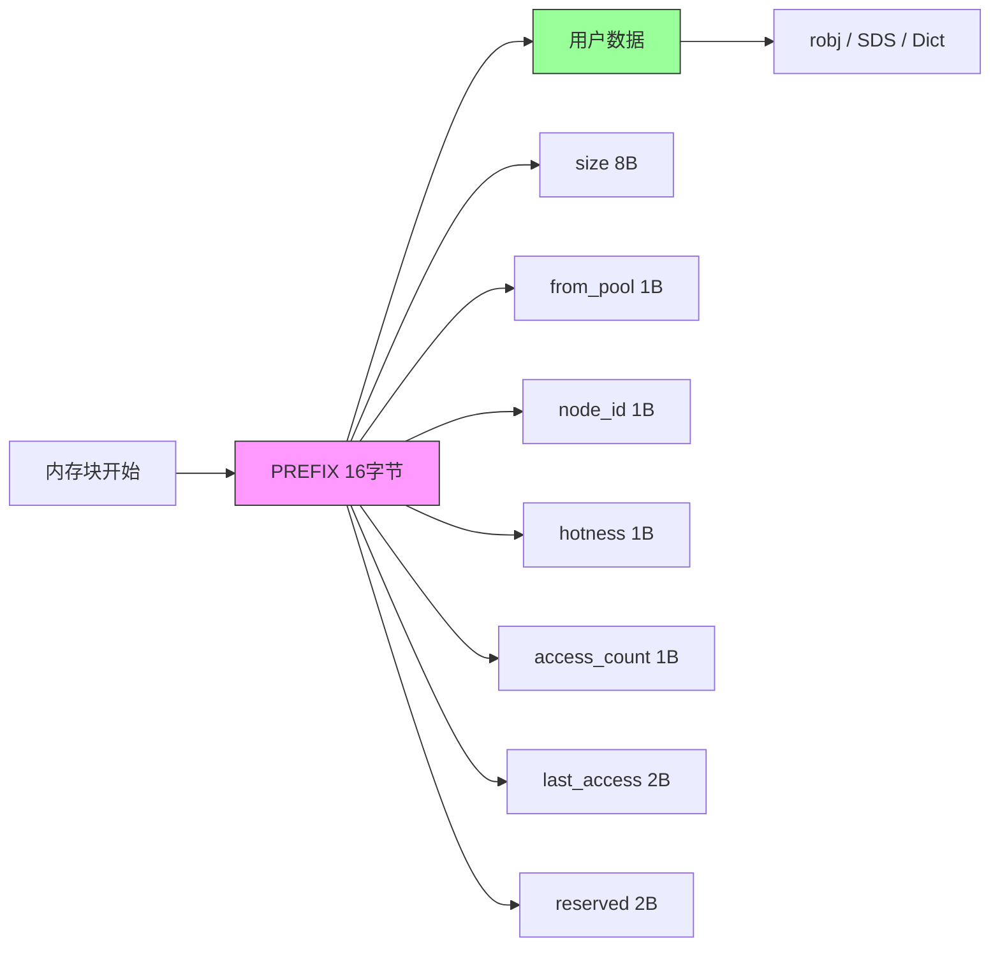

# NUMA 内存分配（zmalloc 适配）

## 模块概述

`zmalloc.c/h` 是 Redis 的标准内存分配入口。本项目在此模块中增加了 NUMA 感知能力，使所有 Redis 内存分配都能自动感知 NUMA 拓扑并选择最优节点。

## 核心设计：PREFIX 元数据内联

### 设计目标

将 NUMA 元数据直接嵌入分配对象的头部，避免额外的字典查找和内存开销。

### PREFIX 结构

```c
// 16 字节对齐
typedef struct {
    size_t size;           // 8 字节 - 实际分配大小
    char from_pool;        // 1 字节 - 来源标记（0=Direct, 1=Pool, 2=Slab）
    char node_id;          // 1 字节 - NUMA 节点 ID
    uint8_t hotness;       // 1 字节 - 热度级别（0-7）
    uint8_t access_count;  // 1 字节 - 访问计数（循环计数）
    uint16_t last_access;  // 2 字节 - LRU 时钟低 16 位
    char reserved[2];      // 2 字节 - 保留对齐
} numa_alloc_prefix_t;     // 总计 16 字节
```

### 指针布局



**指针关系**：
- `numa_alloc` 返回指向 PREFIX 开始的指针
- `zmalloc` 返回 `ptr + 16` 给用户
- 释放时通过 `ptr - 16` 找回 PREFIX

## 分配路径

### 统一入口：zmalloc()

```c
void *zmalloc(size_t size) {
    // 1. 确定目标 NUMA 节点
    int node = get_current_numa_node();

    // 2. 根据大小选择分配路径
    void *ptr;
    size_t total_size;

    if (should_use_slab(size)) {
        // Slab 快速路径（≤128B）
        ptr = numa_slab_alloc(size, node, &total_size);
    } else if (size <= NUMA_POOL_MAX_ALLOC) {
        // Pool 路径（≤4KB）
        ptr = numa_pool_alloc(size, node, &total_size);
    } else {
        // Direct 路径（>4KB）
        ptr = numa_alloc_onnode(size + PREFIX_SIZE, node);
        if (ptr) {
            total_size = size + PREFIX_SIZE;
            // 写入 PREFIX
            numa_alloc_prefix_t *prefix = (numa_alloc_prefix_t *)ptr;
            prefix->size = size;
            prefix->from_pool = 0;
            prefix->node_id = node;
            prefix->hotness = 0;
            prefix->access_count = 0;
            prefix->last_access = LRU_CLOCK();
        }
        ptr = (char *)ptr + PREFIX_SIZE;
    }

    // 3. 更新统计
    update_zmalloc_stat_alloc(total_size);

    return ptr;
}
```

### 节点选择策略

```c
int get_current_numa_node(void) {
    // 1. 检查是否有线程本地设置
    int node = numa_pool_get_node();
    if (node >= 0) return node;

    // 2. 根据当前 CPU 推导 NUMA 节点
    int cpu = sched_getcpu();
    return cpu_to_node(cpu);

    // 3. 回退：使用交错分配
    return numa_interleave_node();
}
```

## 热度管理接口

### 读取热度

```c
uint8_t numa_get_hotness(void *ptr) {
    if (!ptr) return 0;
    numa_alloc_prefix_t *prefix = (numa_alloc_prefix_t *)ptr - 1;
    return prefix->hotness;
}
```

### 设置热度

```c
void numa_set_hotness(void *ptr, uint8_t hotness) {
    if (!ptr) return;
    numa_alloc_prefix_t *prefix = (numa_alloc_prefix_t *)ptr - 1;
    prefix->hotness = hotness;
}
```

### 记录访问

每次 Key 被访问时调用，自动更新 PREFIX 中的热度信息：

```c
void numa_record_access(void *ptr) {
    if (!ptr) return;

    numa_alloc_prefix_t *prefix = (numa_alloc_prefix_t *)ptr - 1;
    uint16_t now = LRU_CLOCK();

    // 1. 计算空闲时间
    uint16_t idle_time = now - prefix->last_access;

    // 2. 阶梯式惰性衰减
    uint8_t decay = calculate_decay(idle_time);
    if (prefix->hotness > decay) {
        prefix->hotness -= decay;
    } else {
        prefix->hotness = 0;
    }

    // 3. 热度 +1（上限为 7）
    if (prefix->hotness < COMPOSITE_LRU_HOTNESS_MAX) {
        prefix->hotness++;
    }

    // 4. 更新访问计数和时间
    prefix->access_count++;
    prefix->last_access = now;
}
```

### 衰减计算

```c
uint8_t calculate_decay(uint16_t idle_secs) {
    if (idle_secs < LAZY_DECAY_STEP1_SECS)   return 0;  // < 10s: 不衰减
    if (idle_secs < LAZY_DECAY_STEP2_SECS)   return 1;  // < 60s: 衰减 1
    if (idle_secs < LAZY_DECAY_STEP3_SECS)   return 2;  // < 5min: 衰减 2
    if (idle_secs < LAZY_DECAY_STEP4_SECS)   return 3;  // < 30min: 衰减 3
    return 7;  // ≥ 30min: 完全清零
}
```

## 释放路径

### zfree()

```c
void zfree(void *ptr) {
    if (!ptr) return;

    // 1. 找回 PREFIX
    numa_alloc_prefix_t *prefix = (numa_alloc_prefix_t *)ptr - 1;

    // 2. 读取元数据
    size_t size = prefix->size;
    int from_pool = prefix->from_pool;
    int node_id = prefix->node_id;

    // 3. 更新统计
    update_zmalloc_stat_free(size + PREFIX_SIZE);

    // 4. 根据来源执行不同释放策略
    if (from_pool == 2) {
        // Slab 来源：原子位图标记空闲
        numa_slab_free(ptr, size, node_id);
    } else if (from_pool == 1) {
        // Pool 来源：加入 Free List
        numa_pool_free(ptr, size, 1);
    } else {
        // Direct 来源：归还系统
        numa_free(prefix, size + PREFIX_SIZE);
    }
}
```

## 统计与查询

### 获取内存使用信息

```c
size_t zmalloc_used_memory(void) {
    return used_memory;  // 全局变量，包含 PREFIX 开销
}
```

### 获取碎片率

```c
float zmalloc_get_fragmentation_ratio(void) {
    size_t rss = getRSS();
    size_t allocated = zmalloc_used_memory();
    return (float)rss / allocated;
}
```

## 与其他模块的关系

### 与 NUMA 池的关系

```
zmalloc ──────────────────────────────┐
    │                                 │
    ├── should_use_slab() ──► slab   │
    │                               │
    ├── ≤ 4KB ──────────────► pool   │
    │                               │
    └── > 4KB ──────────────► direct │
```

zmalloc 不直接实现分配逻辑，而是路由到对应的 NUMA 模块。

### 与 Composite LRU 的关系

Composite LRU 通过 PREFIX 接口读写热度：

```c
// composite_lru.c 中
void composite_lru_record_access(strategy, key, val) {
    // 通过 PREFIX 路径读取当前热度
    uint8_t hotness = numa_get_hotness(val);
    uint8_t access_count = numa_get_access_count(val);
    uint16_t last_access = numa_get_last_access(val);

    // 计算衰减并更新
    // ...

    // 写回 PREFIX
    numa_set_hotness(val, new_hotness);
}
```

### 与 Key 迁移的关系

迁移时通过 PREFIX 判断当前节点：

```c
int numa_get_key_current_node(robj *val) {
    numa_alloc_prefix_t *prefix = (numa_alloc_prefix_t *)val - 1;
    return prefix->node_id;
}
```

迁移完成后更新 PREFIX 中的 node_id：

```c
void numa_set_key_node(robj *val, int new_node) {
    numa_alloc_prefix_t *prefix = (numa_alloc_prefix_t *)val - 1;
    prefix->node_id = new_node;
}
```

## 线程本地存储

为减少锁竞争，使用线程本地存储缓存当前节点：

```c
__thread int t_numa_node = -1;  // 线程本地变量

void numa_pool_set_node(int node) {
    t_numa_node = node;
}

int numa_pool_get_node(void) {
    return t_numa_node;
}
```

## 兼容性

### NUMA 不可用时

通过条件编译优雅降级：

```c
void *zmalloc(size_t size) {
#ifdef HAVE_NUMA
    // NUMA 感知分配
    return numa_aware_alloc(size);
#else
    // 标准分配
    return malloc(size);
#endif
}
```

### API 兼容

所有原有 zmalloc 接口保持不变：
- `zmalloc(size)` - 分配
- `zcalloc(nmemb, size)` - 清零分配
- `zrealloc(ptr, size)` - 重新分配
- `zfree(ptr)` - 释放
- `zstrdup(s)` - 字符串复制

## 关键函数清单

| 函数 | 功能 |
|------|------|
| `zmalloc(size)` | NUMA 感知分配 |
| `zcalloc(nmemb, size)` | NUMA 感知清零分配 |
| `zrealloc(ptr, size)` | 重新分配（保留数据） |
| `zfree(ptr)` | 释放（含 PREFIX 处理） |
| `zmalloc_used_memory()` | 获取总内存使用量 |
| `zmalloc_get_rss()` | 获取 RSS 内存 |
| `numa_get_hotness(ptr)` | 读取热度级别 |
| `numa_set_hotness(ptr, hotness)` | 设置热度级别 |
| `numa_get_access_count(ptr)` | 读取访问计数 |
| `numa_get_last_access(ptr)` | 读取上次访问时间 |
| `numa_record_access(ptr)` | 记录访问（含衰减） |
| `get_current_numa_node()` | 获取当前最优节点 |
