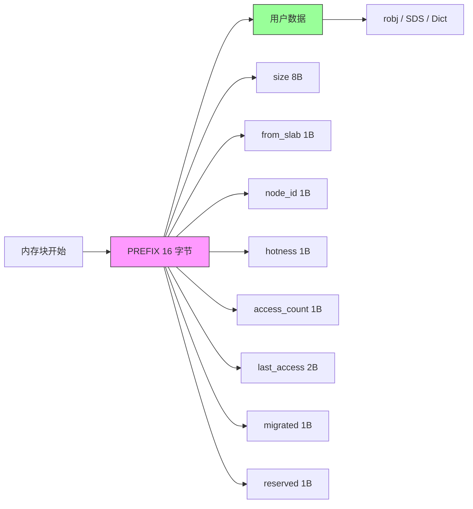

# NUMA 内存分配（zmalloc 适配）

## 模块概述

`zmalloc.c/h` 是 Redis 的标准内存分配入口。本项目在此模块中增加了 NUMA 感知能力，使所有 Redis 内存分配都能自动感知 NUMA 拓扑并选择最优节点。

## 核心设计：PREFIX 元数据内联

### 设计目标

将 NUMA 元数据直接嵌入分配对象的头部，避免额外的字典查找和内存开销。

### PREFIX 结构

```c
// 16 字节对齐
typedef struct {
    size_t size;           // 8 字节 - 实际分配大小
    char from_slab;        // 1 字节 - 来源标记（0=Direct, 1=Slab）
    char node_id;          // 1 字节 - NUMA 节点 ID
    uint8_t hotness;       // 1 字节 - 热度级别（0-7）
    uint8_t access_count;  // 1 字节 - 访问计数（循环计数）
    uint16_t last_access;  // 2 字节 - LRU 时钟低 16 位
    char migrated;         // 1 字节 - 迁移亲和标记
    char reserved[1];      // 1 字节 - 保留对齐
} numa_alloc_prefix_t;     // 总计 16 字节
```

### 指针布局


```mermaid
graph LR
    A[内存块开始] --> B[PREFIX 16 字节]
    B --> C[用户数据]

    B --> B1[size 8B]
    B --> B2[from_slab 1B]
    B --> B3[node_id 1B]
    B --> B4[hotness 1B]
    B --> B5[access_count 1B]
    B --> B6[last_access 2B]
    B --> B7[migrated 1B]
    B --> B8[reserved 1B]

    C --> D[robj / SDS / Dict]

    style B fill:#f9f,stroke:#333
    style C fill:#9f9,stroke:#333
```

**指针关系**：
- `numa_alloc` 返回指向 PREFIX 开始的指针
- `zmalloc` 返回 `ptr + 16` 给用户
- 释放时通过 `ptr - 16` 找回 PREFIX

## 分配路径

### 统一入口：zmalloc()

```c
void *zmalloc(size_t size) {
    // 1. 根据当前策略选择目标 NUMA 节点
    int node = numa_config_get_best_node(size);

    // 2. 根据大小选择分配路径（33 级 class，覆盖 8B-64KB）
    void *ptr;
    size_t total_size;

    if (should_use_slab(size)) {
        // Slab 路径（≤64KB）— 33 级 jemalloc 风格，原子 CAS 无锁
        ptr = numa_slab_alloc(size, node, &total_size);
    } else {
        // Direct 路径（>64KB）
        ptr = numa_alloc_onnode(size + PREFIX_SIZE, node);
        if (ptr) {
            total_size = size + PREFIX_SIZE;
            // 写入 PREFIX
            numa_alloc_prefix_t *prefix = (numa_alloc_prefix_t *)ptr;
            prefix->size = size;
            prefix->from_slab = 0;
            prefix->node_id = node;
            prefix->hotness = 0;
            prefix->access_count = 0;
            prefix->last_access = LRU_CLOCK();
        }
        ptr = (char *)ptr + PREFIX_SIZE;
    }

    // 3. 更新统计（包括 used_memory_node）
    update_zmalloc_stat_alloc(total_size);
    if (node >= 0 && node < ZMALLOC_MAX_NUMA_NODES)
        atomicIncr(used_memory_node[node], total_size);

    return ptr;
}
```

### 节点选择策略

```c
int node = numa_config_get_best_node(size);
// 默认使用 WEIGHTED_INTERLEAVE 策略
// atomicGet(pressure_weights[i]) → 加权随机选择
// 压力越大的节点分配概率越低
```

### 分配路径总结

| 大小 | 路径 | 函数 | 锁依赖 |
|------|------|------|--------|
| ≤ 64KB | Slab | `numa_slab_alloc()` | 原子 CAS（无锁） |
| > 64KB | Direct | `numa_alloc_onnode()` | 系统调用 |

## 释放路径

### 统一入口：zfree()

```c
void zfree(void *ptr) {
    if (!ptr) return;

    // 1. 找回 PREFIX
    numa_alloc_prefix_t *prefix = (numa_alloc_prefix_t *)ptr - 1;

    // 2. 读取元数据
    size_t size = prefix->size;
    char from_slab = prefix->from_slab;
    char node_id = prefix->node_id;

    // 3. 根据来源选择释放路径
    if (from_slab) {
        // Slab 路径
        size_t total_size = prefix->size + PREFIX_SIZE;
        numa_slab_free(ptr, total_size, node_id);
    } else {
        // Direct 路径
        size_t total_size = size + PREFIX_SIZE;
        numa_free(prefix, total_size);
    }

    // 4. 更新统计（tcache 路径在 drain 时才真正递减）
    update_zmalloc_stat_free(size + PREFIX_SIZE);
    if (node_id >= 0 && node_id < ZMALLOC_MAX_NUMA_NODES)
        atomicDecr(used_memory_node[node_id], size + PREFIX_SIZE);
}
```

### 释放路径总结

| `from_slab` | 路径 | 函数 | 说明 |
|-------------|------|------|------|
| 1 (Slab) | Slab | `numa_slab_free()` | 原子位图标记空闲 |
| 0 (Direct) | Direct | `numa_free()` | `numa_free_onnode()` 归还系统 |

## 热度管理接口

### 读取热度

```c
uint8_t numa_get_hotness(void *ptr) {
    if (!ptr) return 0;
    numa_alloc_prefix_t *prefix = (numa_alloc_prefix_t *)ptr - 1;
    return prefix->hotness;
}
```

### 设置热度

```c
void numa_set_hotness(void *ptr, uint8_t hotness) {
    if (!ptr) return;
    numa_alloc_prefix_t *prefix = (numa_alloc_prefix_t *)ptr - 1;
    prefix->hotness = hotness;
}
```

### 记录访问

每次 Key 被访问时调用，由 `composite_lru_record_access()` 实现：

```c
void composite_lru_record_access(strategy, key, val, lru_clock) {
    if (!val) return;

    numa_alloc_prefix_t *prefix = (numa_alloc_prefix_t *)val - 1;
    uint16_t now = lru_clock;

    // 1. 阶梯式惰性衰减
    uint16_t idle = calculate_time_delta(now, prefix->last_access);
    uint8_t decay = compute_lazy_decay_steps(idle);
    uint8_t hotness = prefix->hotness;
    if (hotness > decay) hotness -= decay;
    else hotness = 0;

    // 2. 热度 +1（上限 7）
    if (hotness < COMPOSITE_LRU_HOTNESS_MAX) hotness++;

    // 3. 写回 PREFIX
    prefix->hotness = hotness;
    prefix->access_count++;
    prefix->last_access = now;

    // 4. 同步 key_heat_map + 候选池写入
    // ...
}
```

## 关键函数

| 函数 | 功能 | 返回值 |
|------|------|--------|
| `zmalloc(size)` | NUMA 感知分配 | 用户指针 / NULL |
| `zfree(ptr)` | NUMA 感知释放 | - |
| `zrealloc(ptr, size)` | 重新分配 | 新用户指针 / NULL |
| `numa_get_hotness(ptr)` | 读取热度 | 0-7 |
| `numa_set_hotness(ptr, h)` | 设置热度 | - |
| `numa_get_node_id(ptr)` | 读取节点 ID | int |
| `numa_set_node_id(ptr, n)` | 设置节点 ID | - |
| `numa_get_last_access(ptr)` | 读取上次访问时间 | uint16_t |
| `numa_set_last_access(ptr, t)` | 设置上次访问时间 | - |

## Thread-Local Cache (tcache)

### 问题

YCSB 64 线程高并发下，每次 `zmalloc()`/`zfree()` 都需要与 Slab 分配器交互——位图 CAS、`current_slab` 原子加载、慢路径 `pthread_mutex`。这些共享状态操作成为瓶颈，导致 NUMA 版比 vanilla (libc malloc) 慢 25-29%。

### 设计

在 Slab 分配器上层增加 `__thread` 线程本地缓存，类似 jemalloc/tcmalloc 的 tcache 机制：

```c
#define TCACHE_BIN_MAX     64   // 每个 size class 最多缓存 64 个对象
#define TCACHE_DRAIN_COUNT 32   // bin 满时归还一半到 slab

typedef struct {
    void *ptrs[TCACHE_BIN_MAX];   // 用户指针栈
    uint16_t count;
} tcache_bin_t;

typedef struct {
    tcache_bin_t bins[NUMA_POOL_SIZE_CLASSES]; // 33 个 bin
} numa_tcache_t;

static __thread numa_tcache_t tls_tcache;
static __thread int tls_tcache_inited = 0;
```

### O(1) Size Class 查找表

替代原来的 O(33) 线性扫描，扩展为覆盖 0-65536：

```c
#define CLASS_LOOKUP_ENTRIES 8193   // 覆盖 0..65536，步长 8 字节
static int g_class_lookup[CLASS_LOOKUP_ENTRIES];

static inline int fast_size_class(size_t size) {
    if (size > SLAB_MAX_OBJECT_SIZE) return -1;
    return g_class_lookup[(size + 7) >> 3];
}
```

在 `numa_init()` 中预计算一次。

### 分配快路径

```
numa_alloc_with_size(size):
  if size <= 65536 AND lookup table ready:
    cls = fast_size_class(size)
    if bins[cls].count > 0:
      pop user_ptr from bin            ← O(1)，无锁，无 CAS
      update prefix metadata
      return user_ptr                  ← 完成，不递增统计（统计在 put 时保留）
  ... 原有 slab/direct 路径不变 ...
```

### 释放快路径

```
numa_free_with_size(user_ptr):
  if prefix->from_pool AND lookup table ready:
    cls = fast_size_class(prefix->size)
    if bins[cls].count < TCACHE_BIN_MAX:
      push user_ptr into bin           ← 完成，不递减统计
      return
    else:
      drain TCACHE_DRAIN_COUNT items back to slab
      then cache current item
  ... 原有 slab/direct 释放路径不变 ...
```

### tcache 计数一致性修复（v5.0 关键改进）

**问题**：旧版 tcache put 时立即递减 `used_memory`/`used_memory_node`，但 tcache hit 时递增，导致统计不一致。迁移时修改 `prefix->node_id` 但未同步计数器，导致 `used_memory_node` 出现负值。

**修复**：
- **tcache put 时**：仅缓存对象，**不递减** `used_memory`/`used_memory_node` 统计
- **tcache hit 时**：仅返回对象，**不递增** `used_memory`/`used_memory_node` 统计
- **tcache drain/flush 时**：真正释放到 slab，**此时递减** `used_memory`/`used_memory_node` 统计

**效果**：`used_memory_node` 不再出现负值，统计与 `NUMA CONFIG STATS` 扁平输出一致。

### 计数器一致性

| 事件 | `used_memory` | `used_memory_node` | `numa_alloc_slab_*` |
|------|-------------|-------------------|---------------------|
| 从 tcache 分配 | 不变 | 不变 | 不变 |
| 释放到 tcache | 不变 | 不变 | 不变 |
| drain 到 slab | -total_size | -total_size | -total_size |
| 从 slab 分配（miss） | +total_size | +total_size | +total_size |
| 释放到 slab（miss） | -total_size | -total_size | -total_size |

tcache 中的对象从 Redis 视角仍在占用内存（`used_memory` 未减），物理上也占用 slab 槽位。

### 命中率监控

```c
static redisAtomic size_t numa_tcache_alloc_hit  = 0;
static redisAtomic size_t numa_tcache_alloc_miss = 0;
static redisAtomic size_t numa_tcache_free_hit   = 0;
static redisAtomic size_t numa_tcache_free_miss  = 0;
```

可通过 `NUMA CONFIG STATS` 查看命中率。

### 性能效果

tcache 上线后 NUMA 版与 vanilla 的 Phase 2 差距从 ~11.5% 缩小到 ~5.9%。

## 线程安全

- **PREFIX 读写**：Redis 单线程模型，无需额外同步
- **热度更新**：由 `composite_lru_record_access()` 在主线程中串行执行
- **统计计数器**：使用 `atomicIncr` 无锁更新
- **tcache**：`__thread` TLS 变量，每线程独立，无共享状态竞争

## 与其他模块的关系

- **numa_pool.c**：调用 `numa_slab_alloc()` / `numa_slab_free()` 执行实际分配
- **numa_configurable_strategy.c**：调用 `numa_config_get_best_node()` 选择目标节点
- **numa_composite_lru.c**：通过 PREFIX 接口读写热度信息
- **db.c**：在 `lookupKey()` 中调用 `composite_lru_record_access()` 更新热度

## Direct Cache（大对象 FIFO 缓存池）

### 问题

当 value size 超过 64KB 时，每次分配/释放都走 `numa_alloc_onnode()` / `numa_free()` 系统调用路径（mmap + mbind + page fault），在高频大对象负载下成为性能瓶颈。Size Sweep 测试显示 128KB-1MiB 区间 Redis-NUMA 吞吐仅为 Vanilla Redis 的 40%-50%。

### 设计

在 Direct 分配路径上增加 `__thread` 线程本地 FIFO 缓存池，释放大对象时不立即归还系统，而是缓存以供后续同节点、同大小分配复用：

```c
#define DIRECT_CACHE_MAX      16
#define DIRECT_CACHE_MIN_SIZE (SLAB_MAX_OBJECT_SIZE + PREFIX_SIZE + 1)  // >64KB
#define DIRECT_CACHE_MAX_SIZE (2UL << 20)                               // ≤2MB

typedef struct {
    void  *ptrs[DIRECT_CACHE_MAX];    // 缓存的原始指针（含 PREFIX）
    size_t sizes[DIRECT_CACHE_MAX];   // 每个缓存项的总大小
    int    nodes[DIRECT_CACHE_MAX];   // 每个缓存项的 NUMA 节点
    int    count;                     // 当前缓存数量
} direct_cache_t;

static __thread direct_cache_t tls_direct_cache;
```

### 缓存命中（释放路径）

释放大对象时，若总大小在 `DIRECT_CACHE_MIN_SIZE` 到 `DIRECT_CACHE_MAX_SIZE` 范围内，将其推入 FIFO 缓存。缓存满时驱逐最早的条目（FIFO 头部）：

```c
static inline void direct_cache_push(void *raw_ptr, size_t total_size, int node) {
    direct_cache_t *dc = &tls_direct_cache;
    if (dc->count >= DIRECT_CACHE_MAX) {
        // 驱逐 FIFO 头部
        numa_free(dc->ptrs[0], dc->sizes[0]);
        memmove(&dc->ptrs[0], &dc->ptrs[1], ...);
        dc->count--;
    }
    dc->ptrs[dc->count] = raw_ptr;
    dc->sizes[dc->count] = total_size;
    dc->nodes[dc->count] = node;
    dc->count++;
}
```

### 缓存命中（分配路径）

分配大对象时，先在缓存中查找同节点、同大小的条目。命中则直接复用，避免系统调用：

```c
static inline void *direct_cache_pop(int node, size_t total_size) {
    direct_cache_t *dc = &tls_direct_cache;
    for (int i = dc->count - 1; i >= 0; i--) {
        if (dc->nodes[i] == node && dc->sizes[i] == total_size) {
            void *ptr = dc->ptrs[i];
            // 移除该条目
            dc->ptrs[i] = dc->ptrs[--dc->count];
            dc->sizes[i] = dc->sizes[dc->count];
            dc->nodes[i] = dc->nodes[dc->count];
            return ptr;  // 命中
        }
    }
    return NULL;  // 未命中，走 numa_alloc_onnode
}
```

### 监控统计

```c
static redisAtomic size_t numa_direct_cache_hit   = 0;
static redisAtomic size_t numa_direct_cache_miss  = 0;
static redisAtomic size_t numa_direct_cache_evict = 0;
```

可通过 `NUMA CONFIG STATS` 查看命中率。

### 分配路径总结（含 Direct Cache）

| 大小 | 路径 | 函数 | 锁依赖 |
|------|------|------|--------|
| ≤ 64KB | tcache → Slab | `fast_size_class()` → `tcache_bin_t` → `numa_slab_alloc()` | 无锁（TLS + CAS） |
| > 64KB, ≤ 2MB | Direct Cache → Direct | `direct_cache_pop()` → `numa_alloc_onnode()` | 无锁（TLS） |
| > 2MB | Direct | `numa_alloc_onnode()` | 系统调用 |
