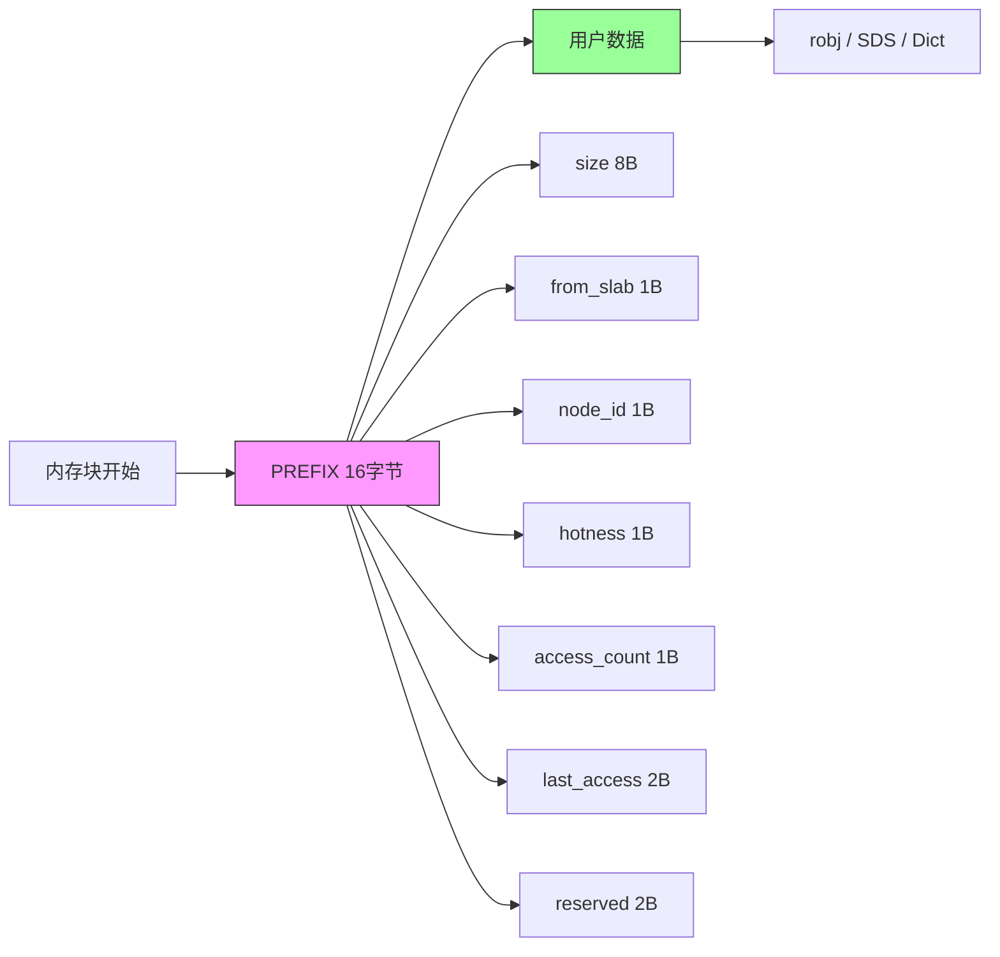

# NUMA 内存分配（zmalloc 适配）

## 模块概述

`zmalloc.c/h` 是 Redis 的标准内存分配入口。本项目在此模块中增加了 NUMA 感知能力，使所有 Redis 内存分配都能自动感知 NUMA 拓扑并选择最优节点。

## 核心设计：PREFIX 元数据内联

### 设计目标

将 NUMA 元数据直接嵌入分配对象的头部，避免额外的字典查找和内存开销。

### PREFIX 结构

```c
// 16 字节对齐
typedef struct {
    size_t size;           // 8 字节 - 实际分配大小
    char from_slab;        // 1 字节 - 来源标记（0=Direct, 1=Slab）
    char node_id;          // 1 字节 - NUMA 节点 ID
    uint8_t hotness;       // 1 字节 - 热度级别（0-7）
    uint8_t access_count;  // 1 字节 - 访问计数（循环计数）
    uint16_t last_access;  // 2 字节 - LRU 时钟低 16 位
    char reserved[2];      // 2 字节 - 保留对齐
} numa_alloc_prefix_t;     // 总计 16 字节
```

### 指针布局


```mermaid
graph LR
    A[内存块开始] --> B[PREFIX 16字节]
    B --> C[用户数据]

    B --> B1[size 8B]
    B --> B2[from_slab 1B]
    B --> B3[node_id 1B]
    B --> B4[hotness 1B]
    B --> B5[access_count 1B]
    B --> B6[last_access 2B]
    B --> B7[reserved 2B]

    C --> D[robj / SDS / Dict]

    style B fill:#f9f,stroke:#333
    style C fill:#9f9,stroke:#333
```

**指针关系**：
- `numa_alloc` 返回指向 PREFIX 开始的指针
- `zmalloc` 返回 `ptr + 16` 给用户
- 释放时通过 `ptr - 16` 找回 PREFIX

## 分配路径

### 统一入口：zmalloc()

```c
void *zmalloc(size_t size) {
    // 1. 根据当前策略选择目标 NUMA 节点
    int node = numa_config_get_best_node(size);

    // 2. 根据大小选择分配路径
    void *ptr;
    size_t total_size;

    if (should_use_slab(size)) {
        // Slab 路径（≤4KB）— 24 级 jemalloc 风格，原子 CAS 无锁
        ptr = numa_slab_alloc(size, node, &total_size);
    } else {
        // Direct 路径（>4KB）
        ptr = numa_alloc_onnode(size + PREFIX_SIZE, node);
        if (ptr) {
            total_size = size + PREFIX_SIZE;
            // 写入 PREFIX
            numa_alloc_prefix_t *prefix = (numa_alloc_prefix_t *)ptr;
            prefix->size = size;
            prefix->from_slab = 0;
            prefix->node_id = node;
            prefix->hotness = 0;
            prefix->access_count = 0;
            prefix->last_access = LRU_CLOCK();
        }
        ptr = (char *)ptr + PREFIX_SIZE;
    }

    // 3. 更新统计
    update_zmalloc_stat_alloc(total_size);

    return ptr;
}
```

### 节点选择策略

```c
int node = numa_config_get_best_node(size);
// 默认使用 WEIGHTED_INTERLEAVE 策略
// atomicGet(pressure_weights[i]) → 加权随机选择
// 压力越大的节点分配概率越低
```

### 分配路径总结

| 大小 | 路径 | 函数 | 锁依赖 |
|------|------|------|--------|
| ≤ 4KB | Slab | `numa_slab_alloc()` | 原子 CAS（无锁） |
| > 4KB | Direct | `numa_alloc_onnode()` | 系统调用 |

## 释放路径

### 统一入口：zfree()

```c
void zfree(void *ptr) {
    if (!ptr) return;

    // 1. 找回 PREFIX
    numa_alloc_prefix_t *prefix = (numa_alloc_prefix_t *)ptr - 1;

    // 2. 读取元数据
    size_t size = prefix->size;
    char from_slab = prefix->from_slab;
    char node_id = prefix->node_id;

    // 3. 根据来源选择释放路径
    if (from_slab) {
        // Slab 路径
        size_t total_size = get_slab_total_size(size);
        numa_slab_free(ptr, total_size, node_id);
    } else {
        // Direct 路径
        size_t total_size = size + PREFIX_SIZE;
        numa_free(prefix, total_size);
    }

    // 4. 更新统计
    update_zmalloc_stat_free(size + PREFIX_SIZE);
}
```

### 释放路径总结

| `from_slab` | 路径 | 函数 | 说明 |
|-------------|------|------|------|
| 1 (Slab) | Slab | `numa_slab_free()` | 原子位图标记空闲 |
| 0 (Direct) | Direct | `numa_free()` | `numa_free_onnode()` 归还系统 |

## 热度管理接口

### 读取热度

```c
uint8_t numa_get_hotness(void *ptr) {
    if (!ptr) return 0;
    numa_alloc_prefix_t *prefix = (numa_alloc_prefix_t *)ptr - 1;
    return prefix->hotness;
}
```

### 设置热度

```c
void numa_set_hotness(void *ptr, uint8_t hotness) {
    if (!ptr) return;
    numa_alloc_prefix_t *prefix = (numa_alloc_prefix_t *)ptr - 1;
    prefix->hotness = hotness;
}
```

### 记录访问

每次 Key 被访问时调用，由 `composite_lru_record_access()` 实现：

```c
void composite_lru_record_access(strategy, key, val, lru_clock) {
    if (!val) return;

    numa_alloc_prefix_t *prefix = (numa_alloc_prefix_t *)val - 1;
    uint16_t now = lru_clock;

    // 1. 阶梯式惰性衰减
    uint16_t idle = calculate_time_delta(now, prefix->last_access);
    uint8_t decay = compute_lazy_decay_steps(idle);
    uint8_t hotness = prefix->hotness;
    if (hotness > decay) hotness -= decay;
    else hotness = 0;

    // 2. 热度 +1（上限 7）
    if (hotness < COMPOSITE_LRU_HOTNESS_MAX) hotness++;

    // 3. 写回 PREFIX
    prefix->hotness = hotness;
    prefix->access_count++;
    prefix->last_access = now;

    // 4. 同步 key_heat_map + 候选池写入
    // ...
}
```

## 关键函数

| 函数 | 功能 | 返回值 |
|------|------|--------|
| `zmalloc(size)` | NUMA 感知分配 | 用户指针 / NULL |
| `zfree(ptr)` | NUMA 感知释放 | - |
| `zrealloc(ptr, size)` | 重新分配 | 新用户指针 / NULL |
| `numa_get_hotness(ptr)` | 读取热度 | 0-7 |
| `numa_set_hotness(ptr, h)` | 设置热度 | - |
| `numa_get_node_id(ptr)` | 读取节点 ID | int |
| `numa_set_node_id(ptr, n)` | 设置节点 ID | - |
| `numa_get_last_access(ptr)` | 读取上次访问时间 | uint16_t |
| `numa_set_last_access(ptr, t)` | 设置上次访问时间 | - |

## 线程安全

- **PREFIX 读写**：Redis 单线程模型，无需额外同步
- **热度更新**：由 `composite_lru_record_access()` 在主线程中串行执行
- **统计计数器**：使用 `atomicIncr` 无锁更新

## 与其他模块的关系

- **numa_pool.c**：调用 `numa_slab_alloc()` / `numa_slab_free()` 执行实际分配
- **numa_configurable_strategy.c**：调用 `numa_config_get_best_node()` 选择目标节点
- **numa_composite_lru.c**：通过 PREFIX 接口读写热度信息
- **db.c**：在 `lookupKey()` 中调用 `composite_lru_record_access()` 更新热度
