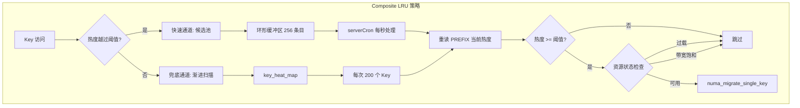
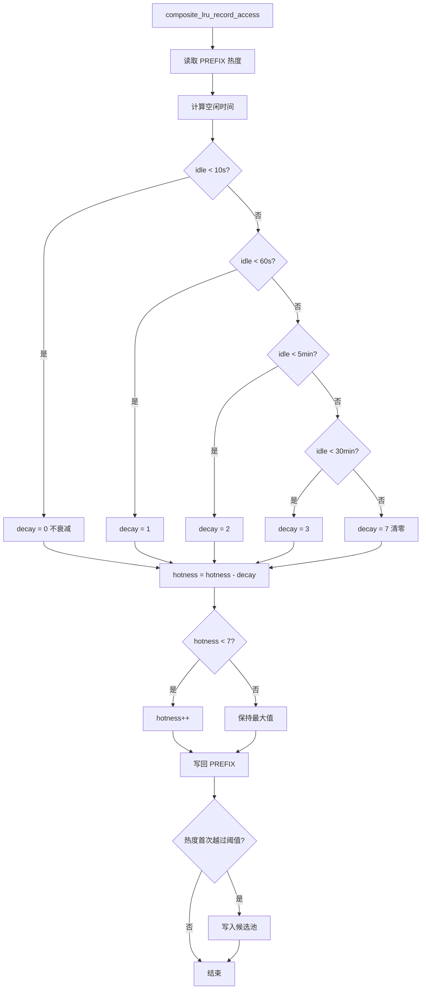
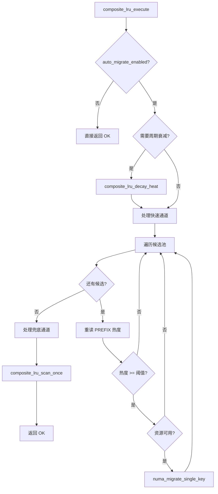
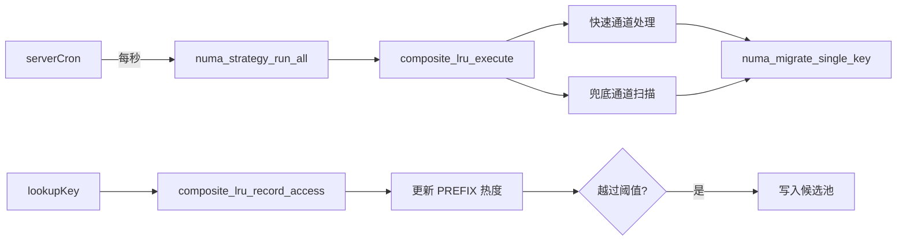

# Composite LRU 策略

## 模块概述

`numa_composite_lru.c/h` 实现了本项目的默认 NUMA 迁移策略——Composite LRU。它结合了 Redis 原生 LRU 机制和 NUMA 感知迁移决策，通过**双通道架构**实现高效的跨节点数据迁移。

**版本**：v2.3

## 设计思想

传统 LRU 只关注访问频率，而 Composite LRU 同时考虑：
1. **访问热度**：Key 的访问频率和近期性
2. **NUMA 位置**：Key 当前所在节点与最优节点的匹配度
3. **资源状态**：目标节点的内存压力、带宽饱和度

## 双通道架构



### 为什么需要双通道？

| 通道 | 优势 | 劣势 | 适用场景 |
|------|------|------|---------|
| 快速通道 | 低延迟（毫秒级） | 可能遗漏冷门热点 | 高频访问的热点数据 |
| 兜底通道 | 全覆盖 | 延迟较高（渐进式） | 低频但重要的热点数据 |

## 核心数据结构

### 可配置参数

```c
typedef struct {
    uint32_t decay_threshold_sec;       // 周期衰减间隔（秒），默认 10
    uint8_t  migrate_hotness_threshold; // 触发迁移的热度阈值，默认 5
    uint8_t  stability_count;           // 字典路径稳定性计数阈值，默认 3
    uint32_t hot_candidates_size;       // 候选池容量，默认 256
    uint32_t scan_batch_size;           // 每次扫描 Key 数，默认 200
    double   overload_threshold;        // 节点内存过载阈值（0~1），默认 0.8
    double   bandwidth_threshold;       // 带宽饱和阈值（0~1），默认 0.9
    double   pressure_threshold;        // 迁移压力阈值（0~1），默认 0.7
    int      auto_migrate_enabled;      // 1=开启自动迁移，0=仅手动，默认 1
} composite_lru_config_t;
```

### Key 热度信息（字典回退路径）

```c
typedef struct {
    uint8_t  hotness;                   // 热度级别（0-7）
    uint8_t  stability_counter;         // 稳定性计数器
    uint16_t last_access;               // 上次访问时间（LRU_CLOCK 低 16 位）
    uint64_t access_count;              // 累计访问次数
    int      current_node;              // 当前所在 NUMA 节点
    int      preferred_node;            // 迁移目标节点
} composite_lru_heat_info_t;
```

### 热点候选池条目

```c
typedef struct {
    void    *key;                       // Key 指针（robj*）
    void    *val;                       // Value 指针（用于重读 PREFIX 热度）
    int      target_node;               // 写入时的目标节点（CPU 所在节点）
    uint8_t  hotness_snapshot;          // 写入时热度快照（仅用于排序）
} hot_candidate_t;
```

### 策略私有数据

```c
typedef struct {
    composite_lru_config_t config;           // 运行时配置

    // 快速通道
    hot_candidate_t *hot_candidates;         // 环形缓冲区
    uint32_t  candidates_head;               // 写入游标
    uint32_t  candidates_count;              // 当前有效数量

    // 兜底通道
    dictIterator *scan_iter;                 // 当前扫描位置

    // 内部状态
    uint64_t last_decay_time;                // 上次衰减时间（微秒）
    dict    *key_heat_map;                   // 字典回退路径热度表

    // 统计
    uint64_t heat_updates;                   // 热度更新次数
    uint64_t migrations_triggered;           // 已触发的迁移次数
    uint64_t decay_operations;               // 衰减操作次数
    uint64_t migrations_completed;           // 已完成的迁移次数
    uint64_t migrations_failed;              // 失败的迁移次数
    uint64_t candidates_written;             // 写入候选池次数
    uint64_t scan_keys_checked;              // 渐进扫描检查的 Key 数
} composite_lru_data_t;
```

## 阶梯式惰性衰减

### 衰减流程图



### 衰减规则

基于 Key 的空闲时间（当前时间 - last_access）进行分级衰减：

| 空闲时间 | 衰减值 | 说明 |
|---------|-------|------|
| < 10 秒 | 0 | 短暂停顿，完全豁免 |
| < 60 秒 | 1 | 短期空闲，轻微衰减 |
| < 5 分钟 | 2 | 中期空闲，中度衰减 |
| < 30 分钟 | 3 | 长期空闲，大幅衰减 |
| ≥ 30 分钟 | 7 | 完全清零 |

### 为什么是"阶梯式"？

1. **计算成本低**：查表而非浮点运算
2. **行为可预测**：4 个明确级别，易于调参
3. **符合实际模式**：短暂停顿不应影响热度判断

### 实现

```c
uint8_t calculate_decay(uint16_t idle_secs) {
    if (idle_secs < LAZY_DECAY_STEP1_SECS)   return 0;  // < 10s
    if (idle_secs < LAZY_DECAY_STEP2_SECS)   return 1;  // < 60s
    if (idle_secs < LAZY_DECAY_STEP3_SECS)   return 2;  // < 5min
    if (idle_secs < LAZY_DECAY_STEP4_SECS)   return 3;  // < 30min
    return 7;  // ≥ 30min: 清零
}
```

## 快速通道：候选池

### 环形缓冲区设计

```
大小：256 条目（可配置）
结构：
  head → 写入位置（持续增长，不模长）
  count → 有效元素数（最多 256）

写入：
  idx = head % size
  buffer[idx] = new_candidate
  head++
  if (count < size) count++

读取：
  start = (head - count) % size
  for i in 0..count-1:
      process buffer[(start + i) % size]
  count = 0  // 清空
```

### 何时写入候选池？

在 Key 被访问时，如果**热度首次越过阈值**且**内存在远程节点**：

```c
void composite_lru_record_access(strategy, key, val) {
    // 1. 读取当前热度
    uint8_t hotness = numa_get_hotness(val);

    // 2. 应用衰减
    uint16_t idle_time = now - numa_get_last_access(val);
    uint8_t decay = calculate_decay(idle_time);
    if (hotness > decay) hotness -= decay;
    else hotness = 0;

    // 3. 热度 +1
    if (hotness < COMPOSITE_LRU_HOTNESS_MAX) hotness++;

    // 4. 写回 PREFIX
    numa_set_hotness(val, hotness);
    numa_set_last_access(val, now);

    // 5. 判断是否写入候选池
    composite_lru_data_t *data = strategy->private_data;
    if (hotness >= data->config.migrate_hotness_threshold &&
        hotness_snapshot < data->config.migrate_hotness_threshold) {
        // 热度首次越过阈值，写入候选池
        add_to_candidates(key, val, target_node, hotness);
    }
}
```

## 兜底通道：渐进扫描

### 扫描逻辑

```c
int composite_lru_scan_once(strategy, batch_size, scanned_out, migrated_out) {
    composite_lru_data_t *data = strategy->private_data;
    int scanned = 0;
    int migrated = 0;

    // 获取或创建迭代器
    if (!data->scan_iter) {
        data->scan_iter = dictGetSafeIterator(data->key_heat_map);
    }

    // 扫描 batch_size 个 Key
    for (int i = 0; i < batch_size; i++) {
        dictEntry *de = dictNext(data->scan_iter);
        if (!de) {
            // 扫描完毕，重置迭代器
            dictReleaseIterator(data->scan_iter);
            data->scan_iter = NULL;
            break;
        }

        // 评估热度
        composite_lru_heat_info_t *heat = dictGetVal(de);
        if (heat->hotness >= data->config.migrate_hotness_threshold) {
            // 触发迁移
            if (try_migrate_key(heat->key, heat->preferred_node) == OK) {
                migrated++;
            }
        }
        scanned++;
    }

    *scanned_out = scanned;
    *migrated_out = migrated;
    data->scan_keys_checked += scanned;
    return scanned;
}
```

### 为什么使用安全迭代器？

因为扫描过程中可能有 Key 被删除或迁移，安全迭代器保证不会访问已释放的内存。

## 执行流程：composite_lru_execute()



每秒 serverCron 调用一次：

```c
int composite_lru_execute(strategy) {
    composite_lru_data_t *data = strategy->private_data;

    // 1. 检查自动迁移开关
    if (!data->config.auto_migrate_enabled) return NUMA_STRATEGY_OK;

    // 2. 周期衰减
    uint64_t now = get_time_us();
    if (now - data->last_decay_time > data->config.decay_threshold_sec * 1000000) {
        composite_lru_decay_heat(data);
        data->last_decay_time = now;
    }

    // 3. 快速通道：处理候选池
    process_candidates(data);

    // 4. 兜底通道：渐进扫描
    uint64_t scanned, migrated;
    composite_lru_scan_once(strategy, data->config.scan_batch_size, &scanned, &migrated);

    return NUMA_STRATEGY_OK;
}
```

### 候选池处理

```c
void process_candidates(data) {
    if (data->candidates_count == 0) return;

    // 遍历候选池
    uint32_t start = (data->candidates_head - data->candidates_count) % data->config.hot_candidates_size;

    for (uint32_t i = 0; i < data->candidates_count; i++) {
        hot_candidate_t *cand = &data->hot_candidates[(start + i) % data->config.hot_candidates_size];

        // 重读 PREFIX 当前热度（不依赖快照）
        uint8_t current_hotness = numa_get_hotness(cand->val);

        // 检查是否仍满足条件
        if (current_hotness < data->config.migrate_hotness_threshold) continue;

        // 检查资源状态
        int resource_state = check_resource_status(cand->target_node);
        if (resource_state != RESOURCE_AVAILABLE) continue;

        // 触发迁移
        if (numa_migrate_single_key(db, cand->key, cand->target_node) == OK) {
            data->migrations_triggered++;
        }
    }

    // 清空候选池
    data->candidates_count = 0;
}
```

### 资源状态检查

```c
int check_resource_status(int node) {
    // 1. 检查内存过载
    double mem_util = get_node_memory_utilization(node);
    if (mem_util > overload_threshold) return RESOURCE_OVERLOADED;

    // 2. 检查带宽饱和
    double bw_util = get_node_bandwidth_utilization(node);
    if (bw_util > bandwidth_threshold) return RESOURCE_BANDWIDTH_SATURATED;

    // 3. 检查迁移压力
    double pressure = get_migration_pressure(node);
    if (pressure > pressure_threshold) return RESOURCE_MIGRATION_PRESSURE;

    return RESOURCE_AVAILABLE;
}
```

## 热度双路径设计

### PREFIX 路径（主路径）

- **条件**：Value 对象存在且包含 PREFIX
- **优势**：零额外内存，O(1) 访问
- **流程**：直接读写 PREFIX 中的热度字段

### 字典回退路径（兼容路径）

- **条件**：PREFIX 不可用（val == NULL）
- **优势**：支持未改造 PREFIX 的老接口
- **流程**：通过 `key_heat_map` 字典维护热度信息

### 路径选择

```c
void composite_lru_record_access(strategy, key, val) {
    if (val != NULL) {
        // PREFIX 路径
        update_hotness_via_prefix(val);
    } else {
        // 字典路径
        update_hotness_via_dict(key);
    }
}
```

## JSON 配置热加载

### 配置文件格式

```json
{
    "migrate_hotness_threshold": 5,
    "hot_candidates_size": 512,
    "scan_batch_size": 500,
    "decay_threshold_sec": 10,
    "auto_migrate_enabled": 1,
    "overload_threshold": 0.8,
    "bandwidth_threshold": 0.9,
    "pressure_threshold": 0.7,
    "stability_count": 3
}
```

### 加载流程

```c
int composite_lru_load_config(path, out_config) {
    // 1. 打开文件
    FILE *fp = fopen(path, "r");
    if (!fp) return -1;

    // 2. 逐行解析 "key": value 格式
    char line[256];
    while (fgets(line, sizeof(line), fp)) {
        // 解析键值对
        // 类型转换并验证范围
        // 填充 out_config
    }

    fclose(fp);
    return 0;
}

int composite_lru_apply_config(strategy, cfg) {
    composite_lru_data_t *data = strategy->private_data;

    // 1. 候选池大小变化 → 重建
    if (cfg->hot_candidates_size != data->config.hot_candidates_size) {
        rebuild_candidates_pool(data, cfg->hot_candidates_size);
    }

    // 2. 应用新配置
    data->config = *cfg;

    // 3. 重置扫描游标
    if (data->scan_iter) {
        dictReleaseIterator(data->scan_iter);
        data->scan_iter = NULL;
    }

    return 0;
}
```

### 热加载命令

```bash
NUMA CONFIG LOAD /path/to/composite_lru.json
```

## 统计信息

```c
typedef struct {
    uint64_t heat_updates;              // 热度更新次数
    uint64_t migrations_triggered;      // 已触发的迁移次数
    uint64_t decay_operations;          // 衰减操作次数
    uint64_t migrations_completed;      // 已完成的迁移次数
    uint64_t migrations_failed;         // 失败的迁移次数
    uint64_t candidates_written;        // 写入候选池次数
    uint64_t scan_keys_checked;         // 渐进扫描累计检查 Key 数
} composite_lru_stats_t;
```

查询命令：
```bash
NUMA CONFIG GET
```

## 手动触发扫描

供 `NUMA MIGRATE SCAN` 命令调用：

```c
int composite_lru_scan_once(strategy, batch_size, &scanned, &migrated);
```

用户可以指定自定义批次大小，而非使用配置值。

## 与其他模块的关系



### 被策略插槽框架调度

```
serverCron() ──► numa_strategy_run_all() ──► composite_lru_execute()
```

### 调用 Key 迁移模块

```
composite_lru_execute()
    │
    ├── process_candidates() ──► numa_migrate_single_key()
    │
    └── scan_once() ──► numa_migrate_single_key()
```

### 接收 zmalloc 访问记录

```
lookupKey() ──► composite_lru_record_access()
```

## 性能特征

| 操作 | 时间复杂度 | 频率 | 说明 |
|------|-----------|------|------|
| record_access | O(1) | 每次 Key 访问 | PREFIX 路径直接更新 |
| 候选池写入 | O(1) | 热度越过阈值时 | 环形缓冲区索引计算 |
| 候选池处理 | O(pool_size) | 每秒一次 | 遍历 256 条目 |
| 渐进扫描 | O(batch_size) | 每秒一次 | 扫描 200 个 Key |
| JSON 加载 | O(n) | 手动触发 | n = JSON 行数 |

## 空间开销

| 组件 | 空间 | 说明 |
|------|------|------|
| 候选池 | 256 × 40B = 10KB | 默认配置 |
| key_heat_map | 按需增长 | 仅字典路径使用 |
| 迭代器 | O(1) | 单一活跃迭代器 |
| **总计** | **< 1MB** | 高度优化 |
