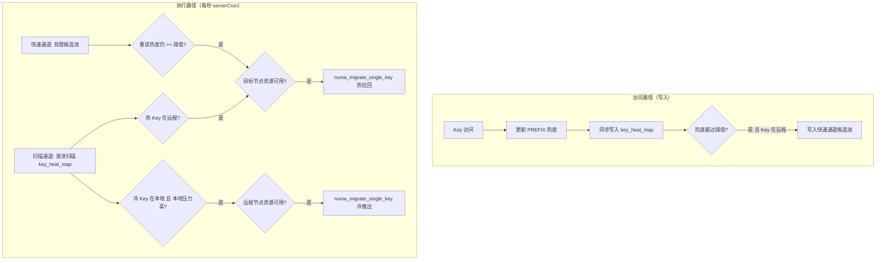
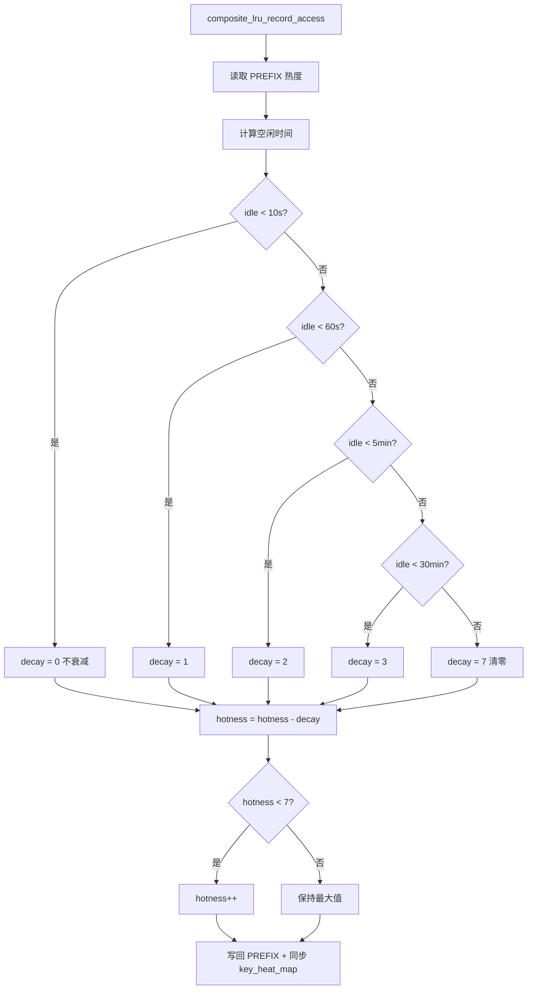
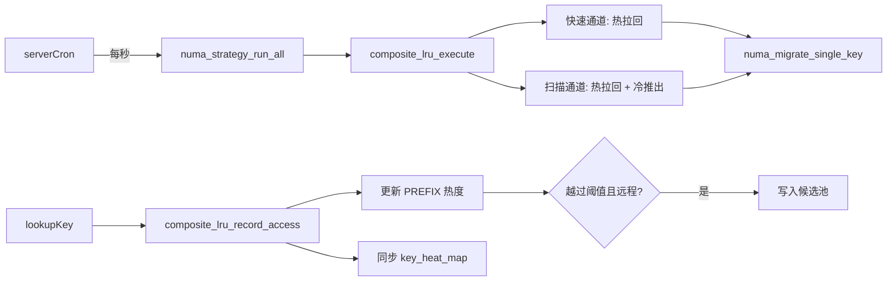

# Composite LRU 策略

## 模块概述

`numa_composite_lru.c/h` 实现了本项目的默认 NUMA 迁移策略——Composite LRU。它结合了 Redis 原生 LRU 机制和 NUMA 感知迁移决策，通过**双通道架构**实现高效的跨节点数据迁移。

**版本**：v2.4

## 设计思想

传统 LRU 只关注访问频率，而 Composite LRU 同时考虑：
1. **访问热度**：Key 的访问频率和近期性
2. **NUMA 位置**：Key 当前所在节点与最优节点的匹配度
3. **资源状态**：目标节点的内存压力、带宽饱和度

### CXL 场景迁移方向

在 CXL 环境中，Node 0 = DRAM（小容量/低延迟），Node 1 = CXL（大容量/高延迟）。迁移策略为双向：

- **热 Key 拉回**：远程（CXL）上的热 Key 拉回本地（DRAM），减少访问延迟
- **冷 Key 推出**：本地（DRAM）上的冷 Key 推到远程（CXL），释放 DRAM 空间

迁移目标节点由 `compute_target_node(mem_node, current_node)` 决定：
- Key 在远程 → `target = current_node`（拉回本地）
- Key 已在本地 → 不入候选池（候选池仅处理远程热 Key）

冷 Key 推出由扫描通道在本地节点压力超过 `overload_threshold` 时自动触发。

## 双通道架构



### 为什么需要双通道？

| 通道 | 优势 | 劣势 | 适用场景 |
|------|------|------|---------|
| 快速通道 | 低延迟（毫秒级） | 仅处理远程热 Key | 高频访问的远程热点数据 |
| 扫描通道 | 全覆盖 + 冷 Key 推出 | 延迟较高（渐进式） | 低频热点 + DRAM 压力下的冷数据驱逐 |

## 核心数据结构

### 可配置参数

```c
typedef struct {
    uint32_t decay_threshold_sec;       // 周期衰减间隔（秒），默认 10
    uint8_t  migrate_hotness_threshold; // 触发迁移的热度阈值，默认 5
    uint8_t  stability_count;           // 字典路径稳定性计数阈值，默认 3
    uint32_t hot_candidates_size;       // 候选池容量，默认 256
    uint32_t scan_batch_size;           // 每次扫描 Key 数，默认 200
    double   overload_threshold;        // 节点内存过载阈值（0~1），默认 0.8
    double   bandwidth_threshold;       // 带宽饱和阈值（0~1），默认 0.9
    double   pressure_threshold;        // 迁移压力阈值（0~1），默认 0.7
    int      auto_migrate_enabled;      // 1=开启自动迁移，0=仅手动，默认 1
} composite_lru_config_t;
```

### Key 热度信息（key_heat_map 字典）

```c
typedef struct {
    uint8_t  hotness;                   // 热度级别（0-7）
    uint8_t  stability_counter;         // 稳定性计数器
    uint16_t last_access;               // 上次访问时间（LRU_CLOCK 低 16 位）
    uint64_t access_count;              // 累计访问次数
    int      current_node;              // 当前所在 NUMA 节点
    int      preferred_node;            // 迁移目标节点（热拉回时由候选池设置）
} composite_lru_heat_info_t;
```

### 热点候选池条目

```c
typedef struct {
    void    *key;                       // Key 指针（robj*）
    void    *val;                       // Value 指针（用于重读 PREFIX 热度）
    int      target_node;               // 迁移目标节点（compute_target_node 计算）
    uint8_t  hotness_snapshot;          // 写入时热度快照（仅用于排序）
} hot_candidate_t;
```

### 策略私有数据

```c
typedef struct {
    redisDb *db;                            // 数据库上下文（用于实际迁移调用）
    composite_lru_config_t config;           // 运行时配置

    // 快速通道
    hot_candidate_t *hot_candidates;         // 环形缓冲区
    uint32_t  candidates_head;               // 写入游标
    uint32_t  candidates_count;              // 当前有效数量

    // 扫描通道
    dictIterator *scan_iter;                 // 当前扫描位置

    // 内部状态
    uint64_t last_decay_time;                // 上次衰减时间（微秒）
    dict    *key_heat_map;                   // 热度表（PREFIX 路径同步写入）

    // 统计
    uint64_t heat_updates;                   // 热度更新次数
    uint64_t migrations_triggered;           // 已触发的迁移次数
    uint64_t decay_operations;               // 衰减操作次数
    uint64_t migrations_completed;           // 已完成的迁移次数
    uint64_t migrations_failed;              // 失败的迁移次数
    uint64_t candidates_written;             // 写入候选池次数
    uint64_t scan_keys_checked;              // 渐进扫描检查的 Key 数
    uint64_t migrations_bw_blocked;          // 因带宽饱和被阻止的迁移次数
} composite_lru_data_t;
```

## 阶梯式惰性衰减

### 衰减流程图



### 衰减规则

基于 Key 的空闲时间（当前时间 - last_access）进行分级衰减：

| 空闲时间 | 衰减值 | 说明 |
|---------|-------|------|
| < 10 秒 | 0 | 短暂停顿，完全豁免 |
| < 60 秒 | 1 | 短期空闲，轻微衰减 |
| < 5 分钟 | 2 | 中期空闲，中度衰减 |
| < 30 分钟 | 3 | 长期空闲，大幅衰减 |
| ≥ 30 分钟 | 7 | 完全清零 |

## 访问路径：composite_lru_record_access()

每次 `lookupKey()` 命中时调用。执行以下操作：

1. **阶梯衰减**：根据空闲时间衰减热度
2. **热度递增**：`hotness++`（上限 7）
3. **写回 PREFIX**：更新 `hotness`、`access_count`、`last_access`
4. **同步 key_heat_map**：更新或创建字典条目，确保扫描通道有数据可迭代
5. **候选池写入**：当热度首次越过阈值 且 Key 在远程节点时，写入环形缓冲区

```c
void composite_lru_record_access(strategy, key, val) {
    uint8_t hotness = numa_get_hotness(val);
    // ... 衰减 + 递增 ...

    // 同步写入 key_heat_map（扫描通道依赖）
    composite_lru_heat_info_t *info = dictFetchValue(data->key_heat_map, key);
    if (info) {
        info->hotness = hotness;
        info->access_count++;
        info->current_node = mem_node;
    } else if (hotness >= thr) {
        // 新条目，仅在热度达到阈值时创建
        info = zmalloc(sizeof(*info));
        info->hotness = hotness;
        info->current_node = mem_node;
        dictAdd(data->key_heat_map, key, info);
    }

    // 快速通道：仅远程热 Key 入候选池
    int target = compute_target_node(mem_node, current_node);
    if (target >= 0 && hotness_before < thr && hotness >= thr) {
        add_to_candidates(key, val, target, hotness);
    }
}
```

## 执行路径：composite_lru_execute()

每秒由 `serverCron` → `numa_strategy_run_all()` 调用。

### 快速通道（候选池处理）

```c
// 遍历候选池中所有条目
for each candidate:
    // 重读 PREFIX 当前热度（不依赖快照）
    cur_hotness = numa_get_hotness(cand->val);
    mem_node = numa_get_node_id(cand->val);

    // 带宽感知：源节点繁忙时降低迁移门槛
    if (src_bw > 0.7) effective_threshold--;

    if (cur_hotness >= effective_threshold && mem_node != cand->target_node) {
        // 检查目标节点资源
        if (check_resource_status(cand->target_node) == RESOURCE_AVAILABLE) {
            // 实际迁移：调用 numa_migrate_single_key()
            numa_migrate_single_key(data->db, cand->key, cand->target_node);
        }
    }
```

### 扫描通道（渐进扫描 + 冷 Key 推出）

```c
// 判断本地节点压力，高压力时启用冷 Key 推出
double local_pressure = numaGetNodePressure(current_node);
int demote_enabled = (local_pressure >= overload_threshold && numa_max_node() >= 1);

for each entry in key_heat_map (batch_size per tick):
    // 路径 A：热 Key 拉回本地
    if (hotness >= threshold && preferred_node >= 0 && current_node != preferred_node) {
        if (check_resource_status(preferred_node) == AVAILABLE) {
            numa_migrate_single_key(db, key, preferred_node);
        }
        continue;
    }

    // 路径 B：冷 Key 推出到远程（本地压力高时）
    if (demote_enabled && current_node == local_node && hotness < threshold) {
        target = (local_node == 0) ? 1 : 0;
        if (check_resource_status(target) == AVAILABLE) {
            numa_migrate_single_key(db, key, target);
        }
    }
```

### 资源状态检查

```c
int check_resource_status(int node_id) {
    // 1. 内存过载检查
    double pressure = numaGetNodePressure(node_id);
    if (pressure >= overload_threshold) return RESOURCE_OVERLOADED;

    // 2. 带宽饱和检查
    double bw_usage = numa_bw_get_usage(node_id);
    if (bw_usage >= bandwidth_threshold) return RESOURCE_BANDWIDTH_SATURATED;

    // 3. 综合迁移压力检查（内存 60% + 带宽 40%）
    double combined = pressure * 0.6 + bw_usage * 0.4;
    if (combined >= pressure_threshold) return RESOURCE_MIGRATION_PRESSURE;

    return RESOURCE_AVAILABLE;
}
```

## 热度双路径设计

### PREFIX 路径（主路径）

- **条件**：Value 对象存在且包含 PREFIX
- **优势**：零额外内存，O(1) 访问
- **流程**：直接读写 PREFIX 中的热度字段
- **同步**：每次更新后同步写入 `key_heat_map`

### key_heat_map 字典（扫描通道数据源）

- **用途**：为扫描通道提供可迭代的热 Key 集合
- **写入时机**：PREFIX 路径每次 `record_access` 时同步更新
- **淘汰**：热度清零后由扫描通道清理

```c
void composite_lru_record_access(strategy, key, val) {
    if (val != NULL) {
        // PREFIX 路径：更新热度 + 同步 key_heat_map
        update_hotness_via_prefix(val);
        sync_to_heat_map(key, val);
    } else {
        // 字典路径（兼容 val==NULL 的场景）
        update_hotness_via_dict(key);
    }
}
```

## JSON 配置热加载

### 配置文件格式

```json
{
    "migrate_hotness_threshold": 5,
    "hot_candidates_size": 512,
    "scan_batch_size": 500,
    "decay_threshold_sec": 10,
    "auto_migrate_enabled": 1,
    "overload_threshold": 0.8,
    "bandwidth_threshold": 0.9,
    "pressure_threshold": 0.7,
    "stability_count": 3
}
```

### 加载命令

```bash
NUMA CONFIG LOAD /path/to/composite_lru.json
```

## 统计信息

| 字段 | 说明 |
|------|------|
| `heat_updates` | 热度更新次数 |
| `migrations_triggered` | 已触发的迁移次数 |
| `migrations_completed` | 实际完成的迁移次数 |
| `migrations_failed` | 失败的迁移次数 |
| `migrations_bw_blocked` | 因带宽饱和被阻止的迁移次数 |
| `decay_operations` | 衰减操作次数 |
| `candidates_written` | 写入候选池次数 |
| `scan_keys_checked` | 渐进扫描累计检查 Key 数 |

查询命令：
```bash
NUMA MIGRATE STATS
```

## 手动触发扫描

供 `NUMA MIGRATE SCAN` 命令调用：

```bash
NUMA MIGRATE SCAN COUNT 500
```

## 与其他模块的关系



### 被策略插槽框架调度

```
serverCron() ──► numa_strategy_run_all() ──► composite_lru_execute()
```

### 调用 Key 迁移模块

```
composite_lru_execute()
    │
    ├── 快速通道 ──► numa_migrate_single_key()  (热 Key 拉回)
    │
    └── 扫描通道 ──► numa_migrate_single_key()  (热拉回 + 冷推出)
```

### 接收 lookupKey 访问记录

```
lookupKey() ──► composite_lru_record_access()
```

## 性能特征

| 操作 | 时间复杂度 | 频率 | 说明 |
|------|-----------|------|------|
| record_access | O(1) | 每次 Key 访问 | PREFIX 路径直接更新 + key_heat_map 同步 |
| 候选池写入 | O(1) | 热度越过阈值时 | 环形缓冲区索引计算 |
| 候选池处理 | O(pool_size) | 每秒一次 | 遍历 256 条目 |
| 渐进扫描 | O(batch_size) | 每秒一次 | 扫描 200 个 Key（含冷 Key 推出检查） |
| JSON 加载 | O(n) | 手动触发 | n = JSON 行数 |

## 空间开销

| 组件 | 空间 | 说明 |
|------|------|------|
| 候选池 | 256 × 40B = 10KB | 默认配置 |
| key_heat_map | 按需增长 | 达到热度阈值的 Key 才创建条目 |
| 迭代器 | O(1) | 单一活跃迭代器 |
| **总计** | **< 1MB** | 高度优化 |
