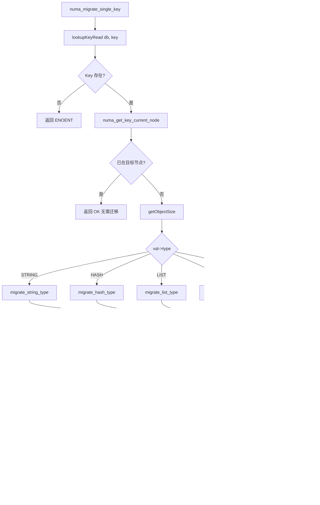

# Key 级别迁移

## 模块概述

`numa_key_migrate.c/h` 实现 Redis Key 在 NUMA 节点间的细粒度迁移功能。它以 `robj` 为迁移单元，支持 5 种 Redis 数据类型的专用迁移适配器，通过原子指针切换确保迁移过程的一致性。

## 核心特性

1. **Key 级别粒度**：单个 Key 即可迁移，无需整库迁移
2. **多类型适配**：String、Hash、List、Set、ZSet 各有专用迁移函数
3. **原子指针切换**：迁移过程对客户端透明
4. **完整统计追踪**：记录迁移次数、字节数、耗时等指标

## 数据结构

### Key 的 NUMA 元数据

```c
typedef struct {
    int current_node;               // 当前所在 NUMA 节点
    uint8_t hotness_level;          // 热度级别（0-7）
    uint16_t last_access_time;      // 上次访问时间（LRU 时钟）
    size_t memory_footprint;        // 内存占用大小（字节）
    uint64_t access_count;          // 累计访问次数
} key_numa_metadata_t;
```

### 迁移请求

```c
typedef struct {
    robj *key_obj;                  // 目标 Key 对象
    int source_node;                // 源 NUMA 节点
    int target_node;                // 目标 NUMA 节点
    size_t data_size;               // 待迁移数据大小
    uint64_t start_time;            // 迁移开始时间（微秒）
} migration_request_t;
```

### 迁移统计

```c
typedef struct {
    uint64_t total_migrations;              // 总迁移次数
    uint64_t successful_migrations;         // 成功迁移次数
    uint64_t failed_migrations;             // 失败迁移次数
    uint64_t total_bytes_migrated;          // 总迁移字节数
    uint64_t total_migration_time_us;       // 总迁移耗时（微秒）
    uint64_t peak_concurrent_migrations;    // 峰值并发迁移数
} numa_key_migrate_stats_t;
```

### 模块全局上下文

```c
typedef struct {
    int initialized;                        // 初始化标志
    dict *key_metadata;                     // Key 元数据哈希表
    pthread_mutex_t mutex;                  // 并发控制锁
    numa_key_migrate_stats_t stats;         // 迁移统计
} numa_key_migrate_ctx_t;
```

## 核心接口

### 单 Key 迁移流程图


```mermaid
graph TB
    A[numa_migrate_single_key] --> B[lookupKeyRead db, key]
    B --> C{Key 存在?}
    C -->|否| D[返回 ENOENT]
    C -->|是| E[numa_get_key_current_node]
    E --> F{已在目标节点?}
    F -->|是| G[返回 OK 无需迁移]
    F -->|否| H[getObjectSize]
    H --> I{val->type}
    
    I -->|STRING| J[migrate_string_type]
    I -->|HASH| K[migrate_hash_type]
    I -->|LIST| L[migrate_list_type]
    I -->|SET| M[migrate_set_type]
    I -->|ZSET| N[migrate_zset_type]
    
    J --> O[目标节点分配内存]
    K --> O
    L --> O
    M --> O
    N --> O
    
    O --> P[复制数据]
    P --> Q[原子指针切换]
    Q --> R[释放旧内存]
    R --> S[更新 PREFIX node_id]
    S --> T[更新统计]
    T --> U[返回 OK]
```

### 模块初始化

```c
int numa_key_migrate_init(void);
void numa_key_migrate_cleanup(void);
```

### 单 Key 迁移（按 robj 指针）

```c
int numa_migrate_single_key(redisDb *db, robj *key, int target_node);
```

**参数**：
- `db`: Redis 数据库实例
- `key`: Key 对象（robj*）
- `target_node`: 目标 NUMA 节点 ID

**返回**：`NUMA_KEY_MIGRATE_OK` 或错误码

> 该接口用于 `NUMA MIGRATE KEY` 手动命令，内部通过 `dictFind(db->dict, key->ptr)` 查找。

### 按 Key Name 迁移（SDS 字符串）

```c
int numa_migrate_key_by_name(redisDb *db, const char *keyname, int target_node);
```

**参数**：
- `db`: Redis 数据库实例
- `keyname`: Key 名称（SDS / const char*）
- `target_node`: 目标 NUMA 节点 ID

**返回**：`NUMA_KEY_MIGRATE_OK` 或错误码

> **v3.0 新增**。该接口用于 Composite LRU 自动迁移路径。候选池存储的是 `sdsdup` 出来的 key name 副本，直接传给 `dictFind(db->dict, keyname)` 查找 value，再按类型调用迁移适配器。与 `numa_migrate_single_key` 共享同一套类型适配器（`migrate_string_type` 等），区别仅在于查找方式。

### 批量迁移

```c
int numa_migrate_multiple_keys(redisDb *db, list *key_list, int target_node);
```

### 模式迁移

```c
int numa_migrate_keys_by_pattern(redisDb *db, const char *pattern, int target_node);
```

支持通配符：`user:*`、`order:1???`

### 全库迁移

```c
int numa_migrate_entire_database(redisDb *db, int target_node);
```

## 数据类型迁移适配器

### String 类型

```c
int migrate_string_type(robj *key_obj, robj *val_obj, int target_node) {
    // 跳过非 RAW/EMBSTR 编码（整数编码无需迁移）
    if (val_obj->encoding != OBJ_ENCODING_RAW &&
        val_obj->encoding != OBJ_ENCODING_EMBSTR)
        return NUMA_KEY_MIGRATE_OK;

    sds old_str = val_obj->ptr;
    size_t total = sdsAllocSize(old_str);           // 整个 SDS 分配块大小
    void *old_base = sdsAllocPtr(old_str);          // SDS 原始指针（含 PREFIX）
    ptrdiff_t str_offset = (char *)old_str - (char *)old_base;

    // 1. 在目标节点分配新内存（通过 numa_zmalloc_onnode，走 Direct 路径）
    void *new_base = numa_zmalloc_onnode(total, target_node);
    if (!new_base) return NUMA_KEY_MIGRATE_ENOMEM;

    // 2. 完整复制（含 SDS header）
    memcpy(new_base, old_base, total);

    // 3. 重新计算 SDS 指针并原子切换
    sds new_str = (char *)new_base + str_offset;
    val_obj->ptr = new_str;

    // 4. 释放旧内存（sdsfree -> zfree -> 根据 PREFIX 路由到 Slab 或 Direct）
    sdsfree(old_str);

    // 5. 更新 PREFIX 中的 node_id
    numa_set_node_id(val_obj, target_node);
    return NUMA_KEY_MIGRATE_OK;
}
```

### Hash 类型

```c
int migrate_hash_type(robj *key_obj, robj *val_obj, int target_node) {
    if (val_obj->encoding == OBJ_ENCODING_HT) {
        // 哈希表编码：迁移整个 dict
        dict *old_dict = val_obj->ptr;
        dict *new_dict = dictCreate(&hashDictType);

        // 在新节点重新分配
        dictIterator *iter = dictGetIterator(old_dict);
        dictEntry *entry;
        while ((entry = dictNext(iter)) != NULL) {
            sds key = sdsdup(dictGetKey(entry));
            sds val = sdsdup(dictGetVal(entry));
            // 新分配的 key/val 会在目标节点
            dictAdd(new_dict, key, val);
        }
        dictReleaseIterator(iter);

        // 原子切换
        val_obj->ptr = new_dict;
        dictRelease(old_dict);
    } else if (val_obj->encoding == OBJ_ENCODING_ZIPLIST) {
        // 压缩列表：整体迁移
        unsigned char *old_zl = val_obj->ptr;
        unsigned char *new_zl = zmalloc_onnode(ziplistBlobLen(old_zl), target_node);
        memcpy(new_zl, old_zl, ziplistBlobLen(old_zl));
        val_obj->ptr = new_zl;
        zfree(old_zl);
    }
    return NUMA_KEY_MIGRATE_OK;
}
```

### List 类型

完整实现 QuickList 节点级迁移，包括 LZF 压缩和原始 ziplist 两种编码的处理：

```c
int migrate_list_type(robj *key_obj, robj *val_obj, int target_node) {
    if (val_obj->encoding != OBJ_ENCODING_QUICKLIST)
        return NUMA_KEY_MIGRATE_ETYPE;

    numa_alloc_push_node(target_node);
    quicklist *old_ql = val_obj->ptr;
    quicklist *new_ql = zmalloc(sizeof(quicklist));

    // 复制 quicklist 头部元数据
    new_ql->count = old_ql->count;
    new_ql->fill = old_ql->fill;
    new_ql->compress = old_ql->compress;

    // 遍历所有节点，逐个迁移
    quicklistNode *old_node = old_ql->head;
    while (old_node) {
        quicklistNode *new_node = zmalloc(sizeof(quicklistNode));
        // 复制节点元数据（count, sz, encoding, container 等）

        if (old_node->encoding == QUICKLIST_NODE_ENCODING_LZF) {
            // LZF 压缩：复制 quicklistLZF 结构 + 压缩数据
            quicklistLZF *old_lzf = (quicklistLZF *)old_node->zl;
            size_t lzf_sz = sizeof(quicklistLZF) + old_lzf->sz;
            new_node->zl = zmalloc(lzf_sz);
            memcpy(new_node->zl, old_node->zl, lzf_sz);
        } else {
            // 原始 ziplist：按 sz 大小复制
            new_node->zl = zmalloc(old_node->sz);
            memcpy(new_node->zl, old_node->zl, old_node->sz);
        }
        // 链接到新 quicklist...
        old_node = old_node->next;
    }

    // 释放旧 quicklist 所有节点和 ziplist
    val_obj->ptr = new_ql;
    numa_alloc_pop_node();
    return NUMA_KEY_MIGRATE_OK;
}
```

### Set 类型

完整实现 Intset 和 Hashtable 两种编码的迁移：

```c
int migrate_set_type(robj *key_obj, robj *val_obj, int target_node) {
    if (val_obj->encoding == OBJ_ENCODING_INTSET) {
        // 整数集合：整体 memcpy 迁移
        intset *old_is = val_obj->ptr;
        size_t is_len = intsetBlobLen(old_is);
        intset *new_is = numa_zmalloc_onnode(is_len, target_node);
        memcpy(new_is, old_is, is_len);
        val_obj->ptr = new_is;
        zfree(old_is);
    } else if (val_obj->encoding == OBJ_ENCODING_HT) {
        // 哈希表：迁移 dict + 所有 sds 元素
        numa_alloc_push_node(target_node);
        dict *old_dict = val_obj->ptr;
        dict *new_dict = dictCreate(old_dict->type, old_dict->privdata);
        dictExpand(new_dict, dictSize(old_dict));

        dictIterator *iter = dictGetIterator(old_dict);
        dictEntry *entry;
        while ((entry = dictNext(iter)) != NULL) {
            sds new_member = sdsnewlen(dictGetKey(entry), sdslen(dictGetKey(entry)));
            dictAdd(new_dict, new_member, NULL);
        }
        dictReleaseIterator(iter);

        val_obj->ptr = new_dict;
        dictRelease(old_dict);
        numa_alloc_pop_node();
    }
    return NUMA_KEY_MIGRATE_OK;
}
```

### ZSet 类型

完整实现 Ziplist 和 Skiplist 两种编码的迁移：

```c
int migrate_zset_type(robj *key_obj, robj *val_obj, int target_node) {
    if (val_obj->encoding == OBJ_ENCODING_ZIPLIST) {
        // 压缩列表：整体 memcpy 迁移
        unsigned char *old_zl = val_obj->ptr;
        size_t zl_len = ziplistBlobLen(old_zl);
        unsigned char *new_zl = numa_zmalloc_onnode(zl_len, target_node);
        memcpy(new_zl, old_zl, zl_len);
        val_obj->ptr = new_zl;
        zfree(old_zl);
    } else if (val_obj->encoding == OBJ_ENCODING_SKIPLIST) {
        // 跳表：迁移 zset 结构 + dict + skiplist
        numa_alloc_push_node(target_node);
        zset *old_zs = val_obj->ptr;
        zset *new_zs = zmalloc(sizeof(zset));
        new_zs->zsl = zslCreate();
        new_zs->dict = dictCreate(old_zs->dict->type, old_zs->dict->privdata);
        dictExpand(new_zs->dict, dictSize(old_zs->dict));

        // 从 tail 向前遍历，逐元素插入新跳表
        zskiplistNode *old_node = old_zs->zsl->tail;
        while (old_node) {
            sds new_ele = sdsnewlen(old_node->ele, sdslen(old_node->ele));
            zskiplistNode *new_sl = zslInsert(new_zs->zsl, old_node->score, new_ele);
            dictAdd(new_zs->dict, new_ele, &new_sl->score);
            old_node = old_node->backward;
        }

        dictRelease(old_zs->dict);
        zslFree(old_zs->zsl);
        zfree(old_zs);
        val_obj->ptr = new_zs;
        numa_alloc_pop_node();
    }
    return NUMA_KEY_MIGRATE_OK;
}
```

## 迁移流程

### numa_migrate_single_key() 完整流程

```
numa_migrate_single_key(db, key, target_node)
    │
    ├── 1. 获取 Key 的 value 对象
    │     robj *val = lookupKeyRead(db, key);
    │     └── 不存在 ──► 返回 ENOENT
    │
    ├── 2. 获取当前节点
    │     int current_node = numa_get_key_current_node(val);
    │     └── 已在目标节点 ──► 返回 OK（无需迁移）
    │
    ├── 3. 计算内存占用
    │     size_t size = getObjectSize(val);
    │
    ├── 4. 根据编码类型选择适配器
    │     switch (val->type) {
    │         case OBJ_STRING:  migrate_string_type()
    │         case OBJ_HASH:    migrate_hash_type()
    │         case OBJ_LIST:    migrate_list_type()
    │         case OBJ_SET:     migrate_set_type()
    │         case OBJ_ZSET:    migrate_zset_type()
    │     }
    │
    ├── 5. 执行迁移
    │     ├── 目标节点分配新内存
    │     ├── 复制数据
    │     ├── 原子指针切换
    │     └── 释放旧内存
    │
    ├── 6. 更新元数据
    │     numa_set_key_node(val, target_node);
    │
    ├── 7. 更新统计
    │     stats.successful_migrations++
    │     stats.total_bytes_migrated += size
    │
    └── 8. 返回 OK
```

## 热度追踪

### 主路径：PREFIX 内联

热度追踪的主路径通过 `composite_lru_record_access()` 实现，直接读写分配对象头部的 PREFIX 元数据：

```c
// composite_lru_record_access 签名（4 参数）
void composite_lru_record_access(numa_strategy_t *strategy, void *key, void *val, uint16_t current_time);
```

调用链：
```
lookupKey() 命中
    │
    ├── composite_lru_record_access(strategy, key->ptr, val, lru_clock)
    │     │
    │     ├── 1. numa_get_hotness(val)           // 读 PREFIX 热度
    │     ├── 2. 计算空闲时间 + 阶梯衰减
    │     ├── 3. 热度 +1（上限 7）
    │     ├── 4. 写回 PREFIX (hotness, access_count, last_access)
    │     ├── 5. 同步 key_heat_map 字典（扫描通道数据源）
    │     └── 6. 热度首次越过阈值 且 在远程 → 写入候选池
    │
    └── 返回 Value
```

**PREFIX 字段**（16 字节，详见 [03-zmalloc-numa.md](03-zmalloc-numa.md)）：
- `hotness`（1B）：热度级别 0-7
- `access_count`（1B）：循环计数
- `last_access`（2B）：LRU 时钟低 16 位

### 兼容回退：key_numa_metadata_t

当 Value 指针不可用时（如 val==NULL 的特殊场景），回退到字典路径：

```c
typedef struct {
    int current_node;               // 当前所在 NUMA 节点
    uint8_t hotness_level;          // 热度级别（0-7）
    uint16_t last_access_time;      // 上次访问时间（LRU 时钟）
    size_t memory_footprint;        // 内存占用大小（字节）
    uint64_t access_count;          // 累计访问次数
} key_numa_metadata_t;
```

> **设计说明**：PREFIX 路径（主路径）零额外内存、O(1) 访问，是所有正常 Key 访问的热度追踪入口。`key_numa_metadata_t` 字典路径仅作兼容保留。

### 热度衰减

衰减逻辑集成在 `composite_lru_record_access()` 内部（阶梯式惰性衰减），不作为独立函数存在。详见 [06-numa-composite-lru.md](06-numa-composite-lru.md) 的衰减规则。

## 元数据管理

### 获取 Key 元数据

```c
key_numa_metadata_t* numa_get_key_metadata(robj *key) {
    return dictFetchValue(key_metadata, key);
}
```

### 获取当前节点

```c
int numa_get_key_current_node(robj *key) {
    // 优先从 PREFIX 读取
    robj *val = lookupKeyRead(db, key);
    if (val) {
        return numa_get_key_current_node_from_prefix(val);
    }

    // 回退到元数据字典
    key_numa_metadata_t *meta = numa_get_key_metadata(key);
    return meta ? meta->current_node : -1;
}
```

### Key 删除通知

防止内存泄漏：

```c
void numa_on_key_delete(robj *key) {
    // 从元数据字典中移除
    dictDelete(key_metadata, key);
}
```

## 错误码

```c
#define NUMA_KEY_MIGRATE_OK       0    // 操作成功
#define NUMA_KEY_MIGRATE_ERR     -1    // 一般错误
#define NUMA_KEY_MIGRATE_ENOENT  -2    // Key 不存在
#define NUMA_KEY_MIGRATE_EINVAL  -3    // 参数无效
#define NUMA_KEY_MIGRATE_ENOMEM  -4    // 内存不足
#define NUMA_KEY_MIGRATE_ETYPE   -5    // 不支持的数据类型
```

## 统计查询

```c
void numa_get_migration_statistics(numa_key_migrate_stats_t *stats) {
    pthread_mutex_lock(&ctx.mutex);
    *stats = ctx.stats;
    pthread_mutex_unlock(&ctx.mutex);
}

void numa_reset_migration_statistics(void) {
    pthread_mutex_lock(&ctx.mutex);
    memset(&ctx.stats, 0, sizeof(numa_key_migrate_stats_t));
    pthread_mutex_unlock(&ctx.mutex);
}
```

## 原子性保证

### 单线程保障

Redis 主线程处理所有客户端命令，迁移操作：
1. 在主线程执行
2. 迁移期间不会有其他命令访问该 Key
3. 指针切换是原子操作（赋值即生效）

### 迁移过程

```
1. 查找 Key ──► 获得 robj *val
2. 分配新内存 ──► void *new_ptr
3. 复制数据 ──► memcpy(new_ptr, val->ptr, size)
4. 指针切换 ──► val->ptr = new_ptr  （原子操作）
5. 释放旧内存 ──► zfree(old_ptr)
```

步骤 4 是关键：指针切换后立即生效，后续对该 Key 的访问都使用新内存。

## 与其他模块的关系

### 被 Composite LRU 调用

```
composite_lru_execute()
    │
    ├── 快速通道 ──► numa_migrate_key_by_name()  (SDS key name)
    │
    └── 兜底通道 ──► numa_migrate_key_by_name()  (SDS key name)
```

### 被统一命令接口调用

```
numa_command.c
    │
    ├── NUMA MIGRATE KEY ──► numa_migrate_single_key()  (robj* key)
    ├── NUMA MIGRATE DB  ──► numa_migrate_entire_database()
    └── NUMA MIGRATE SCAN ──► composite_lru_scan_once()
```

### 与 zmalloc 的关系

迁移时使用 `zmalloc_onnode()` 在目标节点分配新内存：

```c
void *new_ptr = zmalloc_onnode(size, target_node);
```

### 与 Key 删除的关系

当 Key 被删除时，通知 NUMA 模块清理元数据：

```c
// db.c 中
void dbDelete(redisDb *db, robj *key) {
    // ...
    numa_on_key_delete(key);
}
```

## 性能特征

| 操作 | 时间复杂度 | 说明 |
|------|-----------|------|
| 单 Key 迁移 | O(data_size) | 主要耗时在 memcpy |
| 批量迁移 | O(n × avg_size) | n = Key 数量 |
| 模式迁移 | O(N) | N = 匹配 Key 数 |
| 全库迁移 | O(db_size) | 全库 Key 数量 |

### 优化建议

1. **批量迁移**：多个 Key 迁移到同一节点时，使用批量接口
2. **错峰迁移**：避免在高峰期执行大量迁移
3. **监控统计**：通过 `NUMA MIGRATE STATS` 观察迁移频率

## 使用示例

### 手动迁移单个 Key

```bash
redis-cli NUMA MIGRATE KEY user:100 1
```

### 迁移匹配模式的 Key

```bash
redis-cli NUMA MIGRATE PATTERN "session:*" 1
```

### 查询 Key 元数据

```bash
redis-cli NUMA MIGRATE INFO user:100
```

返回：
```
type: string
current_node: 0
hotness_level: 5
access_count: 1234
numa_nodes_available: 2
current_cpu_node: 0
```

## 配置参数

```c
#define DEFAULT_MIGRATE_THRESHOLD   5    // 默认迁移热度阈值
#define DEFAULT_BATCH_SIZE          50   // 默认批量迁移数量
```

这些参数可通过 Composite LRU 的 JSON 配置文件调整。
