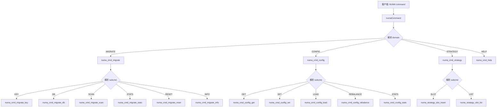
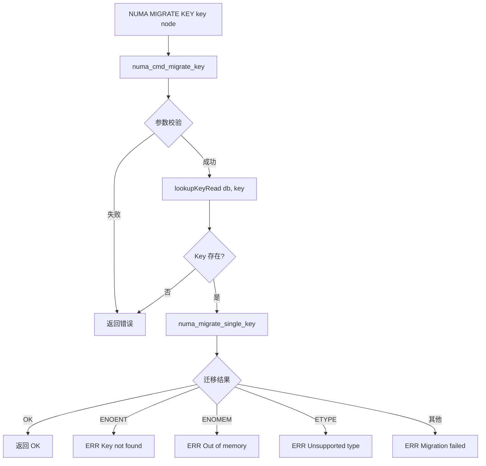

# 统一命令接口

## 模块概述

`numa_command.c` 实现了统一的 `NUMA` Redis 命令，作为所有 NUMA 相关操作的入口。它采用三域路由设计，将命令分发到 MIGRATE、CONFIG、STRATEGY 三个子域。

## 命令注册

在 Redis 启动时注册：

```c
// server.c 中
struct redisCommand numa_commands[] = {
    {"numa", numaCommand, 0, NULL, 0, 0, 0, 0, 0, 0, 0},
    {0}
};
```

## 命令路由



## MIGRATE 子域

### NUMA MIGRATE KEY

将指定 Key 迁移到目标 NUMA 节点。

**语法**：
```
NUMA MIGRATE KEY <key> <node>
```

**参数**：
- `key`: Key 名称
- `node`: 目标 NUMA 节点 ID

**返回**：
- `OK`: 迁移成功
- `ERR <reason>`: 迁移失败

**示例**：
```bash
redis-cli NUMA MIGRATE KEY user:100 1
# OK

redis-cli NUMA MIGRATE KEY nonexistent 1
# ERR Key not found
```

**实现流程图**：



**实现**：
```c
void numa_cmd_migrate_key(client *c) {
    robj *key = c->argv[3];
    int target_node = atoi(c->argv[4]->ptr);

    int ret = numa_migrate_single_key(c->db, key, target_node);

    switch (ret) {
        case NUMA_KEY_MIGRATE_OK:
            addReply(c, shared.ok);
            break;
        case NUMA_KEY_MIGRATE_ENOENT:
            addReplyError(c, "Key not found");
            break;
        default:
            addReplyError(c, "Migration failed");
    }
}
```

### NUMA MIGRATE DB

将整个数据库迁移到目标节点。

**语法**：
```
NUMA MIGRATE DB <node>
```

**示例**：
```bash
redis-cli NUMA MIGRATE DB 1
# MIGRATING: Migrating 12345 keys to node 1
```

**实现**：
```c
void numa_cmd_migrate_db(client *c) {
    int target_node = atoi(c->argv[3]->ptr);
    int ret = numa_migrate_entire_database(c->db, target_node);

    if (ret == NUMA_KEY_MIGRATE_OK) {
        addReplyStatus(c, "Database migration completed");
    } else {
        addReplyError(c, "Database migration failed");
    }
}
```

### NUMA MIGRATE SCAN

触发一轮渐进扫描，迁移满足条件的 Key。

**语法**：
```
NUMA MIGRATE SCAN [COUNT <n>]
```

**参数**：
- `COUNT n`: 本次扫描的 Key 数量（默认使用配置的 scan_batch_size）

**返回**：
```
1) "scanned": (integer) 200
2) "migrated": (integer) 15
```

**示例**：
```bash
redis-cli NUMA MIGRATE SCAN COUNT 500
# 1) "scanned"
# 2) (integer) 500
# 3) "migrated"
# 4) (integer) 23
```

**实现**：
```c
void numa_cmd_migrate_scan(client *c) {
    uint32_t batch_size = strategy->config.scan_batch_size;  // 默认值

    // 解析 COUNT 参数
    if (c->argc == 5) {
        batch_size = atoi(c->argv[4]->ptr);
    }

    uint64_t scanned, migrated;
    composite_lru_scan_once(strategy, batch_size, &scanned, &migrated);

    addReplyMapLen(c, 2);
    addReplyBulkCString(c, "scanned");
    addReplyLongLong(c, scanned);
    addReplyBulkCString(c, "migrated");
    addReplyLongLong(c, migrated);
}
```

### NUMA MIGRATE STATS

显示迁移统计信息。

**语法**：
```
NUMA MIGRATE STATS
```

**返回**（12 个字段）：
```
 1) "total_migrations"
 2) (integer) 1234
 3) "successful_migrations"
 4) (integer) 1200
 5) "failed_migrations"
 6) (integer) 34
 7) "total_bytes_migrated"
 8) (integer) 104857600
 9) "total_migration_time_us"
10) (integer) 5230000
11) "peak_concurrent_migrations"
12) (integer) 3
```

### NUMA MIGRATE RESET

重置迁移统计。

**语法**：
```
NUMA MIGRATE RESET
```

**返回**：`OK`

### NUMA MIGRATE INFO

查询指定 Key 的 NUMA 元数据。

**语法**：
```
NUMA MIGRATE INFO <key>
```

**返回**：
```
 1) "type"
 2) "string"
 3) "current_node"
 4) (integer) 0
 5) "hotness_level"
 6) (integer) 5
 7) "access_count"
 8) (integer) 1234
 9) "numa_nodes_available"
10) (integer) 2
11) "current_cpu_node"
12) (integer) 0
```

## CONFIG 子域

### NUMA CONFIG GET

查询当前 NUMA 配置。

**语法**：
```
NUMA CONFIG GET
```

**返回**（16 个字段）：
```
 1) "strategy"
 2) "local-first"
 3) "nodes"
 4) (integer) 2
 5) "balance_threshold"
 6) "0.300000"
 7) "auto_rebalance"
 8) "enabled"
 9) "cxl_optimization"
10) "disabled"
11) "rebalance_interval"
12) (integer) 60000000
13) "min_allocation_size"
14) (integer) 16
15) "node_weights"
16) "[1, 1]"
```

### NUMA CONFIG SET

设置配置参数。

**语法**：
```
NUMA CONFIG SET <param> <value>
```

**支持的参数**：

| 参数 | 值类型 | 示例 |
|------|-------|------|
| `strategy` | 策略名称 | `local-first`, `interleave`, `weighted` |
| `weight` | `<node> <value>` | `0 2` |
| `cxl_optimization` | `on`/`off` | `on` |
| `balance_threshold` | 浮点数 | `0.5` |

**示例**：
```bash
redis-cli NUMA CONFIG SET strategy interleave
# OK

redis-cli NUMA CONFIG SET weight 0 2
# OK

redis-cli NUMA CONFIG SET cxl_optimization on
# OK

redis-cli NUMA CONFIG SET balance_threshold 0.5
# OK
```

### NUMA CONFIG LOAD

从 JSON 文件加载 Composite LRU 配置。

**语法**：
```
NUMA CONFIG LOAD [path]
```

**参数**：
- `path`: JSON 配置文件路径（可选，默认使用启动时配置的路径）

**示例**：
```bash
redis-cli NUMA CONFIG LOAD /etc/redis/composite_lru.json
# OK: Configuration loaded successfully
```

**JSON 文件格式**：
```json
{
    "migrate_hotness_threshold": 5,
    "hot_candidates_size": 512,
    "scan_batch_size": 500,
    "decay_threshold_sec": 10,
    "auto_migrate_enabled": 1,
    "overload_threshold": 0.8,
    "bandwidth_threshold": 0.9,
    "pressure_threshold": 0.7,
    "stability_count": 3
}
```

### NUMA CONFIG REBALANCE

手动触发重新平衡。

**语法**：
```
NUMA CONFIG REBALANCE
```

**返回**：`OK` 或错误信息

### NUMA CONFIG STATS

显示节点分配统计。

**语法**：
```
NUMA CONFIG STATS
```

**返回**：
```
1) "node_0_allocations"
2) (integer) 5678
3) "node_0_bytes"
4) (integer) 536870912
5) "node_1_allocations"
6) (integer) 4321
7) "node_1_bytes"
8) (integer) 483183820
```

## STRATEGY 子域

### NUMA STRATEGY SLOT

插入策略到指定插槽。

**语法**：
```
NUMA STRATEGY SLOT <id> <name>
```

**参数**：
- `id`: 插槽 ID（0-15）
- `name`: 策略名称

**示例**：
```bash
redis-cli NUMA STRATEGY SLOT 2 my-custom-strategy
# OK: Strategy 'my-custom-strategy' inserted into slot 2
```

### NUMA STRATEGY LIST

列出所有策略插槽状态。

**语法**：
```
NUMA STRATEGY LIST
```

**返回**：
```
 1) "slot_0"
 2) "name: noop, enabled: yes, executions: 100"
 3) "slot_1"
 4) "name: composite-lru, enabled: yes, executions: 100"
 5) "slot_2"
 6) "empty"
 7) "slot_3"
 8) "empty"
...
```

## HELP 子域

### NUMA HELP

显示帮助信息。

**语法**：
```
NUMA HELP
```

**返回**：
```
NUMA <domain> <subcommand> [args...]

Domains:
  MIGRATE  - Key migration commands
  CONFIG   - Configuration management
  STRATEGY - Strategy slot management
  HELP     - Show this help

MIGRATE subcommands:
  KEY <key> <node>       - Migrate a single key to target node
  DB <node>              - Migrate entire database
  SCAN [COUNT <n>]       - Trigger incremental scan and migrate
  STATS                  - Show migration statistics
  RESET                  - Reset migration statistics
  INFO <key>             - Get key's NUMA metadata

CONFIG subcommands:
  GET                    - Get current configuration
  SET <param> <value>    - Set configuration parameter
  LOAD [path]            - Load configuration from JSON file
  REBALANCE              - Trigger manual rebalance
  STATS                  - Show allocation statistics

STRATEGY subcommands:
  SLOT <id> <name>       - Insert strategy into slot
  LIST                   - List all strategy slots
```

## 命令解析实现

### numaCommand() 主入口

```c
void numaCommand(client *c) {
    // 至少需要 2 个参数：NUMA <domain>
    if (c->argc < 2) {
        addReplyError(c, "Wrong number of arguments");
        return;
    }

    char *domain = c->argv[1]->ptr;

    if (strcasecmp(domain, "MIGRATE") == 0) {
        numa_cmd_migrate(c);
    } else if (strcasecmp(domain, "CONFIG") == 0) {
        numa_cmd_config(c);
    } else if (strcasecmp(domain, "STRATEGY") == 0) {
        numa_cmd_strategy(c);
    } else if (strcasecmp(domain, "HELP") == 0) {
        numa_cmd_help(c);
    } else {
        addReplyErrorFormat(c, "Unknown domain: %s", domain);
    }
}
```

### numa_cmd_migrate() 路由

```c
void numa_cmd_migrate(client *c) {
    if (c->argc < 3) {
        addReplyError(c, "Wrong number of arguments for NUMA MIGRATE");
        return;
    }

    char *subcmd = c->argv[2]->ptr;

    if (strcasecmp(subcmd, "KEY") == 0 && c->argc == 5) {
        numa_cmd_migrate_key(c);
    } else if (strcasecmp(subcmd, "DB") == 0 && c->argc == 4) {
        numa_cmd_migrate_db(c);
    } else if (strcasecmp(subcmd, "SCAN") == 0) {
        numa_cmd_migrate_scan(c);
    } else if (strcasecmp(subcmd, "STATS") == 0) {
        numa_cmd_migrate_stats(c);
    } else if (strcasecmp(subcmd, "RESET") == 0) {
        numa_cmd_migrate_reset(c);
    } else if (strcasecmp(subcmd, "INFO") == 0 && c->argc == 4) {
        numa_cmd_migrate_info(c);
    } else {
        addReplyError(c, "Unknown subcommand or wrong arguments");
    }
}
```

### numa_cmd_config() 路由

```c
void numa_cmd_config(client *c) {
    if (c->argc < 3) {
        addReplyError(c, "Wrong number of arguments for NUMA CONFIG");
        return;
    }

    char *subcmd = c->argv[2]->ptr;

    if (strcasecmp(subcmd, "GET") == 0) {
        numa_cmd_config_get(c);
    } else if (strcasecmp(subcmd, "SET") == 0 && c->argc >= 5) {
        numa_cmd_config_set(c);
    } else if (strcasecmp(subcmd, "LOAD") == 0) {
        numa_cmd_config_load(c);
    } else if (strcasecmp(subcmd, "REBALANCE") == 0) {
        numa_cmd_config_rebalance(c);
    } else if (strcasecmp(subcmd, "STATS") == 0) {
        numa_cmd_config_stats(c);
    } else {
        addReplyError(c, "Unknown subcommand or wrong arguments");
    }
}
```

## 错误处理

所有命令都进行参数校验：

```c
if (c->argc != expected_count) {
    addReplyError(c, "Wrong number of arguments");
    return;
}

if (!numa_pool_available()) {
    addReplyError(c, "NUMA is not available");
    return;
}
```

## 权限控制

当前实现中，NUMA 命令无需特殊权限。在生产环境中，建议通过 ACL 限制：

```conf
# redis.conf
acl user admin on >password ~* +@all +numa
acl user readonly on >password ~* +@read -numa
```

## 使用示例

### 完整工作流

```bash
# 1. 查看当前配置
redis-cli NUMA CONFIG GET

# 2. 查看策略状态
redis-cli NUMA STRATEGY LIST

# 3. 查看迁移统计
redis-cli NUMA MIGRATE STATS

# 4. 查询特定 Key 的信息
redis-cli NUMA MIGRATE INFO user:100

# 5. 手动迁移 Key
redis-cli NUMA MIGRATE KEY user:100 1

# 6. 触发扫描迁移
redis-cli NUMA MIGRATE SCAN COUNT 1000

# 7. 加载新配置
redis-cli NUMA CONFIG LOAD /path/to/new_config.json

# 8. 查看新配置
redis-cli NUMA CONFIG GET

# 9. 重置统计
redis-cli NUMA MIGRATE RESET
```

### 监控脚本

结合监控工具定期检查状态：

```bash
#!/bin/bash
while true; do
    redis-cli NUMA MIGRATE STATS
    redis-cli NUMA CONFIG STATS
    sleep 10
done
```

## 性能影响

NUMA 命令的处理时间：
- `MIGRATE KEY`: O(data_size) - 取决于 Key 大小
- `MIGRATE SCAN`: O(batch_size) - 取决于扫描数量
- `CONFIG GET/SET`: O(1) - 快速
- `STRATEGY LIST`: O(slots) - 16 个插槽

所有命令在主线程执行，会阻塞其他命令。建议在低峰期执行批量迁移。
