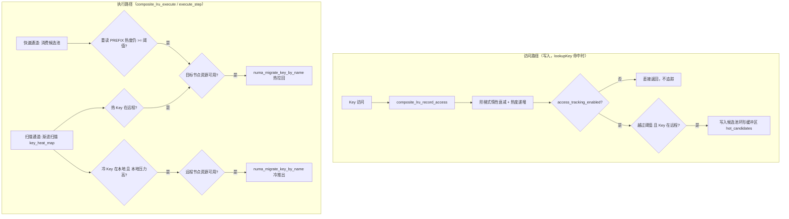
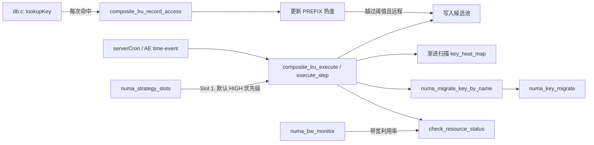

# 构件详情：numa_composite_lru（Composite LRU 策略，Slot 1 默认策略）

> **已退役（[ADR-08](../09-architecture-decisions.md)）**：`src/numa_composite_lru.{c,h}`
> 已从代码库删除。Composite LRU 的算法（staircase 热度衰减 + 双通道候选发现）
> 现在只作为 NUMAflow 的原子操作预设存在（`numaflow/src/nf_strategy.c` 的
> `build_composite_lru`），通过 `NUMA FLOW DEFAULT composite_lru` 或
> `NUMA FLOW LOAD` 使用，不再有内核原生实现或独立的 `key_heat_map`/热点环形
> 缓冲状态。`composite_lru.json` 保留在仓库根目录作为字段参考，但内核不再读取
> 它。以下内容保留作为该模块曾经存在过的设计记录。

> arc42 §5 Building Block View 的构件详情页。对应源码：`src/numa_composite_lru.c` /
> `src/numa_composite_lru.h`，配置文件 `composite_lru.json`。本文档取代原
> `docs/new/06-numa-composite-lru.md`。

## 1. 职责（Responsibility）

`numa_composite_lru` 是策略插槎框架（`numa_strategy_slots`）Slot 1 上注册的**默认
迁移策略**：结合 Redis 原生按 key 的访问信息（PREFIX 元数据）与 NUMA 位置信息，
决定哪些 key 应该在 DRAM（本地节点）与 CXL（远端节点）之间双向迁移——热 key 从远
端拉回本地以降低访问延迟，本地压力过高时把冷 key 推到远端腾出空间。它不负责底层
的字节搬迁（那是 `numa_key_migrate`/`numa_migrate` 的职责），只负责"迁移决策"：
决定迁移谁、迁到哪、什么时候迁。

## 2. 接口（Interface）

对 `numa_strategy_slots` 框架暴露的策略 vtable 接口（`src/numa_composite_lru.h`）：

```c
int  numa_composite_lru_register(void);   // 向策略管理器注册工厂函数
numa_strategy_t* composite_lru_create(void);
void composite_lru_destroy(numa_strategy_t *strategy);

int  composite_lru_init(numa_strategy_t *strategy);
int  composite_lru_execute(numa_strategy_t *strategy);                 // serverCron 路径调用
int  composite_lru_execute_step(numa_strategy_t *strategy,             // AE time-event 路径调用
                                 uint64_t deadline_us, uint32_t budget);
void composite_lru_cleanup(numa_strategy_t *strategy);

// 每次 lookupKey() 命中时调用（访问路径）
void composite_lru_record_access(numa_strategy_t *strategy, void *key,
                                  void *val, void *data_ptr, uint16_t current_time);
void composite_lru_decay_heat(composite_lru_data_t *data);

// JSON 配置：加载 / 应用 / 单项 get-set
int  composite_lru_load_config(const char *path, composite_lru_config_t *out);
int  composite_lru_apply_config(numa_strategy_t *strategy, const composite_lru_config_t *cfg);
int  composite_lru_set_config(numa_strategy_t *strategy, const char *key, const char *value);
int  composite_lru_get_config(numa_strategy_t *strategy, const char *key, char *buf, size_t buf_len);

// 手动触发一轮渐进扫描（供 NUMA MIGRATE SCAN 调用）
int  composite_lru_scan_once(numa_strategy_t *strategy, uint32_t batch_size,
                              uint64_t *scanned_out, uint64_t *migrated_out);

void composite_lru_get_stats(numa_strategy_t *strategy, uint64_t *heat_updates,
                              uint64_t *migrations_triggered, uint64_t *decay_operations);
```

对用户暴露的接口是 `NUMA` 命令族（经 `numa_command.c` 路由，详见
`modules/numa_command.md`）：`NUMA MIGRATE SCAN`、`NUMA MIGRATE STATS`、
`NUMA CONFIG LOAD /path/to/composite_lru.json`、
`NUMA CONFIG SET <field> <value>`（对应下表可配置字段）。

## 3. 内部结构与关键路径（Internal Structure & Key Paths）

### 3.1 双通道架构



| 通道 | 触发方式 | 覆盖范围 | 延迟特性 |
| --- | --- | --- | --- |
| 快速通道（候选池） | 访问时首次越过阈值即入队 | 仅远程热 key | 毫秒级——下一次 `execute`/`execute_step` 立即处理 |
| 扫描通道（渐进扫描） | `serverCron`/AE 每轮扫描 `scan_batch_size` 个 key | 全 keyspace，含冷 key 推出 | 渐进式——覆盖整表需若干轮 |

两个通道共享同一套"重读 PREFIX 当前热度、绝不依赖写入时的快照"原则
（`hotness_snapshot` 字段仅用于候选池内部排序，执行时一律重读），这是为了避免"入
队之后 key 又被访问，热度已经变化"导致的错误迁移决策。

### 3.2 关键数据结构

- `composite_lru_config_t`——JSON 可配置参数（衰减间隔、迁移阈值、候选池容量、
  扫描批量、迁移速率倍增器、三个资源阈值、`auto_migrate_enabled`、
  `access_tracking_enabled`、`locality_stats_enabled`、`debug_logging_enabled`）。
- `composite_lru_heat_info_t`——扫描通道用的字典兜底热度信息（`hotness` /
  `stability_counter` / `last_access` / `access_count` / `current_node` /
  `preferred_node`）。
- `hot_candidate_t`——候选池环形缓冲区条目：`key`（`sds` 副本，写入时
  `sdsdup()`、处理后 `sdsfree()`，避免悬空指针）、`val`、`data_ptr`（用于探测物
  理 NUMA 节点）、`target_node`、`hotness_snapshot`（仅排序用）。
- `composite_lru_data_t`——策略私有状态：`db` 指针（由 `db.c:lookupKey` 每次命中
  时无条件绑定，保证 `execute`/`execute_step` 在 cron/AE 路径下拿到有效数据库上
  下文）、候选池（`hot_candidates` + `candidates_head`/`candidates_tail`/
  `candidates_count`，真正的环形缓冲区，有独立的读写游标）、`scan_iter`（渐进扫
  描游标）、`key_heat_map`（扫描通道数据源）、以及一组统计计数器（含
  `accesses_local`/`accesses_remote`，仅当 `locality_stats_enabled=1` 时才统计）。

### 3.3 阶梯式惰性衰减

按 key 的空闲时长（当前时间 - `last_access`）分级衰减热度，而不是为每个 key 单独
起定时器：

| 空闲时间 | 衰减值 |
| --- | --- |
| < 10 秒 | 0（完全豁免） |
| < 60 秒 | 1 |
| < 5 分钟 | 2 |
| < 30 分钟 | 3 |
| ≥ 30 分钟 | 7（清零） |

衰减只在下一次实际访问 `composite_lru_record_access()` 时"补算"，不消耗任何后台
CPU。

### 3.4 双向迁移方向

在典型 DRAM(Node 0) + CXL(Node 1) 拓扑下：

- **热 key 拉回**：key 在远程节点、热度越过 `migrate_hotness_threshold` → 目标节
  点 = 当前 CPU 所在节点（`compute_target_node()`）。
- **冷 key 推出**：仅由扫描通道触发，当本地节点压力
  （`numaGetNodePressure()`）超过 `overload_threshold` 时，把本地未越过阈值的
  key 推到对侧节点，为热数据腾出空间。

### 3.5 资源保护检查（`check_resource_status`）

每次实际执行迁移前都会检查目标节点：内存压力 ≥ `overload_threshold` →
`RESOURCE_OVERLOADED`；带宽利用率 ≥ `bandwidth_threshold` →
`RESOURCE_BANDWIDTH_SATURATED`；`压力×0.6 + 带宽×0.4` ≥ `pressure_threshold` →
`RESOURCE_MIGRATION_PRESSURE`。三者任一命中都会跳过本次迁移并计入对应统计
（`migrations_overloaded`/`migrations_bw_blocked`），而不是无脑执行——这是这个策
略"不会把慢节点进一步压垮"的核心保护。

### 3.6 双调度路径：serverCron 与 AE

`composite_lru_execute()`（serverCron 每秒调用）和
`composite_lru_execute_step(deadline_us, budget)`（AE time-event 调度器调用，见
`modules/ae_strategy_scheduler.md`）内部走同一套候选池+扫描逻辑，区别只是
`execute_step` 接受一个纳秒级 deadline 和预算，允许在预算耗尽或临近 deadline 时提
前让出——这是让策略执行不再无条件占满一整个 `serverCron` 周期的关键。

## 4. 质量与性能特性（Quality & Performance Characteristics）

- **零额外内存的热度追踪**：热度直接复用 PREFIX 元数据里已有的字段，PREFIX 路径
  是 O(1) 的；`key_heat_map` 字典只是扫描通道需要"可迭代集合"才存在的兜底结构。
- **候选池是真正的环形缓冲区**（有独立的 head/tail 游标），满了会覆盖最旧条目而
  不是拒绝写入或无限增长——这是一个刻意的"宁可漏检一个候选，也不阻塞访问路径"
  的设计取舍。
- **渐进扫描避免长时间阻塞事件循环**：每轮只扫 `scan_batch_size` 个 key（默认
  2500，`migration_rate_multiplier` 可整体放大迁移速率上限），不会因为 keyspace
  很大而单轮扫描耗时过长。
- **可观测性**：9+ 个统计计数器全部可通过 `NUMA MIGRATE STATS` 查询，包括迁移成
  功/失败/被资源保护挡下的细分原因，便于线上定位"为什么某个 key 迟迟没被迁移"。
- **`debug_logging_enabled` 生产环境必须关闭**——JSON 文件里明确标注：打开后
  access/resource/fast-path/scan/key-migrate 全链路都会打日志，高频访问场景下会
  严重拖累吞吐，仅用于调试。

## 5. 与其他模块的关系（Relations to Other Modules）



- 由 `numa_strategy_slots` 框架在 Slot 1 上调度（默认启用，优先级 HIGH）——参见
  `modules/numa_strategy_slots.md`。
- 实际的字节级迁移通过 `numa_migrate_key_by_name()` 委托给 `numa_key_migrate`
  完成（本模块自己不做任何 `memcpy`）。
- 资源保护检查依赖 `numa_bw_monitor` 提供的带宽利用率和节点压力数据。
- 与 `numa_configurable_strategy`（新对象分配到哪个节点）分工互补：本模块负责
  "已有数据往哪迁"，`numa_configurable_strategy` 负责"新数据分配到哪"——两者共同
  决定最终的 NUMA 内存布局。
- 与 Slot 2 的 `numa_tinylfu` 是互斥关系：两者都想控制迁移决策权，官方建议同一时
  间只启用一个（见 `modules/numa_tinylfu.md`）。

## 6. 未解决问题与已知限制（Open Issues & Known Limitations）

- 候选池满时静默覆盖最旧条目，没有告警或计数——如果需要诊断"候选池是否经常溢
  出"，目前只能通过对比 `candidates_written` 与实际迁移数间接推断。
- 冷 key 推出目前只在**扫描通道**触发，快速通道完全不处理冷数据——如果本地压力
  瞬间飙升，缓解速度受限于渐进扫描的批量大小。
- `composite_lru.json` 中的资源阈值（如 `overload_threshold`）需要针对具体硬件
  的实际内存/带宽容量手工调优；文件注释里记录了一个真实教训：QEMU 测试环境
  Node 0 只有 4GB 时，默认 0.8 的阈值在 Phase 2 中期就会被打满导致迁移全部停
  滞，需要按小内存节点场景把阈值提到 0.95——这类阈值不是放之四海皆准的默认值。
- `access_tracking_enabled=0` 会关闭全部热度追踪（包括候选池写入），但不会清空
  已有的 `key_heat_map`——关闭追踪后扫描通道仍会基于历史数据继续工作一段时间，
  行为上不是"立即生效的开关"。
